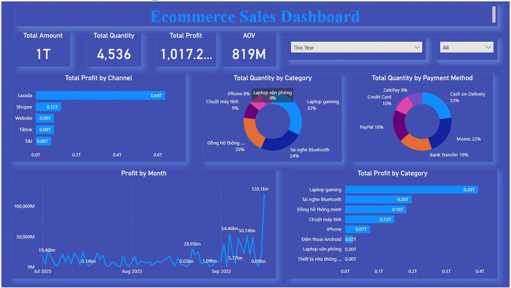
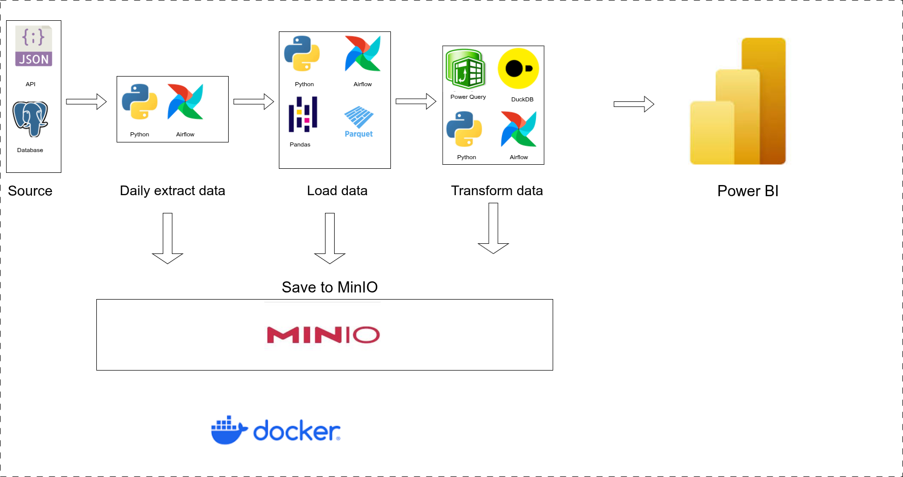

# TRƯỜNG ĐẠI HỌC GIAO THÔNG VẬN TẢI THÀNH PHỐ HỒ CHÍ MINH
## KHOA CÔNG NGHỆ THÔNG TIN

# BÁO CÁO THỰC TẬP TỐT NGHIỆP

**Đề tài:** Thiết kế và Triển khai Hệ thống Data Warehouse cho Bán hàng Đa Nền tảng

**Giảng viên hướng dẫn:** Nguyễn Văn Chiến  
**Sinh viên thực hiện:** Nguyễn Ngọc Tâm  
**MSSV:** 2151050051  
**Lớp:** KM21

*Thành phố Hồ Chí Minh – 2025*

## LỜI MỞ ĐẦU

### 1.1. Bối cảnh và lý do chọn đề tài
Sự phát triển vượt bậc của thương mại điện tử đã biến đổi sâu sắc cách thức các doanh nghiệp vận hành. Đối với các doanh nghiệp vừa và nhỏ kinh doanh sản phẩm công nghệ, việc này mang lại cơ hội lớn nhưng cũng đi kèm với nhiều thách thức. Dữ liệu bán hàng từ các sàn thương mại điện tử lớn như Shopee, Lazada, Tiki, cùng với các kênh bán hàng trực tuyến khác, tạo ra một dòng chảy dữ liệu khổng lồ và liên tục. Tuy nhiên, dữ liệu này thường nằm rải rác, không được tổ chức đồng nhất và thiếu một nền tảng chung để tổng hợp. Các doanh nghiệp này thường phải đối mặt với tình trạng dữ liệu bán hàng không được tổng hợp và cập nhật một cách tự động, dẫn đến việc ra quyết định bị chậm trễ và thiếu chính xác.
Thực trạng này đặt ra một thách thức lớn: làm thế nào để tích hợp, xử lý và phân tích khối lượng dữ liệu đa dạng này một cách hiệu quả để hỗ trợ ra quyết định kinh doanh chiến lược? Việc xử lý dữ liệu thủ công không chỉ tốn kém về thời gian và nhân lực mà còn tiềm ẩn nhiều rủi ro về sai sót, ảnh hưởng trực tiếp đến khả năng kiểm soát tồn kho, tối ưu hóa chuỗi cung ứng và đánh giá hiệu quả kinh doanh tổng thể.
Để giải quyết triệt để vấn đề này, việc xây dựng một kiến trúc Data Warehouse hiện đại trở thành một giải pháp tối ưu. Kiến trúc này cho phép hợp nhất dữ liệu từ nhiều nguồn khác nhau vào một kho dữ liệu tập trung, đảm bảo tính toàn vẹn, nhất quán và khả năng mở rộng. Từ đó, doanh nghiệp có thể thực hiện các phân tích chuyên sâu, tạo ra các báo cáo và dashboard trực quan một cách dễ dàng, giúp đội ngũ quản lý có cái nhìn toàn diện và sâu sắc về hiệu suất kinh doanh, từ đó đưa ra các quyết định chiến lược kịp thời.
Với mong muốn đóng góp một giải pháp thực tiễn, có khả năng ứng dụng cao cho các doanh nghiệp thương mại điện tử, em quyết định thực hiện đề tài luận văn: "Xây dựng hệ thống xử lý và trực quan hóa dữ liệu bán hàng cho doanh nghiệp thương mại điện tử dựa trên kiến trúc Data Warehouse".

### 1.2. Mục tiêu nghiên cứu
Mục tiêu trọng tâm của luận văn là xây dựng một nền tảng dữ liệu (Data Platform) hoàn chỉnh và tự động, có khả năng mở rộng, nhằm giải quyết bài toán tích hợp và phân tích dữ liệu bán hàng từ nhiều nguồn khác nhau. Hệ thống này sẽ là nền tảng vững chắc giúp doanh nghiệp chuyển đổi từ việc xử lý dữ liệu thủ công, rời rạc sang một quy trình tự động, tập trung và dựa trên dữ liệu.

Các mục tiêu cụ thể để đạt được điều này bao gồm:

- **Phân tích và Thiết kế Kiến trúc Hệ thống:**
  - Phân tích sâu các yêu cầu nghiệp vụ và đặc điểm dữ liệu từ các nguồn đa dạng, bao gồm API của các sàn thương mại điện tử (Shopee, Lazada, Tiki, Tiktok Shop) và cơ sở dữ liệu nội bộ (hệ thống ERP).
  - Thiết kế một kiến trúc Data Warehouse hiện đại theo mô hình ELT (Extract, Load, Transform), xác định rõ các tầng dữ liệu (Raw, Staging, Cleaned) để đảm bảo dữ liệu được xử lý một cách có hệ thống.
  - Thiết kế mô hình dữ liệu Dimensional Modeling (mô hình hóa chiều) với các bảng Fact và Dimension, tạo ra một cấu trúc tối ưu cho việc truy vấn và phân tích báo cáo.
  - Xây dựng chiến lược lưu trữ dữ liệu hiệu quả trên MinIO, áp dụng kỹ thuật phân vùng (partitioning) theo thời gian và kênh bán hàng để tối ưu hóa hiệu suất truy vấn.

- **Nghiên cứu và Ứng dụng Công nghệ Hiện đại:**
  - Sử dụng Python và FastAPI để xây dựng các API giả lập, tạo ra nguồn dữ liệu có thể kiểm soát được, phục vụ cho quá trình phát triển và kiểm thử hệ thống.
  - Khai thác sức mạnh của Apache Airflow để xây dựng các quy trình dữ liệu (data pipelines) tự động, có khả năng lập lịch, giám sát, và xử lý lỗi một cách linh hoạt.
  - Tận dụng MinIO làm nền tảng lưu trữ chính cho Data Warehouse, sử dụng định dạng Parquet để tối ưu hóa không gian và tốc độ truy cập.
  - Ứng dụng DuckDB như một engine xử lý dữ liệu hiệu suất cao, cho phép thực hiện các phép biến đổi (transform) phức tạp trực tiếp trên các file Parquet mà không cần đến một hệ quản trị cơ sở dữ liệu riêng biệt.
  - Sử dụng Power BI để kết nối vào kho dữ liệu đã được làm sạch, xây dựng các mô hình dữ liệu và tạo ra các dashboard trực quan, tương tác.

- **Triển khai và Xây dựng Hệ thống Thực tế:**
  - Xây dựng một bộ các DAG (Directed Acyclic Graph) trong Airflow để tự động hóa toàn bộ chu trình ELT: từ việc trích xuất dữ liệu định kỳ, chuyển đổi định dạng, làm sạch và chuẩn hóa dữ liệu.
  - Triển khai các logic kiểm tra và đảm bảo chất lượng dữ liệu (data quality) trong giai đoạn Transform để loại bỏ các sai sót và sự không nhất quán.
  - Xây dựng các bảng dữ liệu tổng hợp (data mart) sẵn sàng cho việc phân tích, tích hợp dữ liệu từ tất cả các kênh bán hàng.
  - Phát triển các dashboard trong Power BI để trực quan hóa các chỉ số kinh doanh (KPI) quan trọng, giúp ban lãnh đạo có cái nhìn tổng quan và chi tiết về hoạt động kinh doanh.

- **Đánh giá và Đề xuất Hướng phát triển:**
  - Đánh giá hiệu suất của hệ thống đã xây dựng, bao gồm thời gian thực thi của các pipeline và khả năng đáp ứng của các dashboard.
  - Kiểm tra tính chính xác và nhất quán của dữ liệu sau khi đã được xử lý và tích hợp.
  - Đề xuất các hướng cải tiến và phát triển trong tương lai, chẳng hạn như tích hợp thêm các nguồn dữ liệu mới, áp dụng các mô hình phân tích nâng cao (dự báo doanh thu, phân khúc khách hàng), và tối ưu hóa hạ tầng để đáp ứng khối lượng dữ liệu lớn hơn.
### 1.3. Đối tượng và phạm vi nghiên cứu

Đối tượng nghiên cứu của luận văn là các mô hình, kiến trúc và công nghệ được sử dụng để xây dựng hệ thống Data Warehouse. Luận văn cũng tập trung vào việc xử lý và phân tích dữ liệu bán hàng từ các nguồn đa dạng của doanh nghiệp thương mại điện tử vừa và nhỏ.
Luận văn sẽ tập trung vào việc thiết kế và triển khai một hệ thống Data Warehouse mẫu, xử lý dữ liệu bán hàng được thu thập từ các kênh TMĐT và website riêng của doanh nghiệp. Kết quả trực quan hóa sẽ được thể hiện thông qua các báo cáo phân tích cơ bản như doanh thu, tồn kho và hiệu quả kinh doanh.

### 1.4. Phương pháp nghiên cứu

- **Nghiên cứu tài liệu:** Tổng hợp và phân tích các lý thuyết liên quan đến Data Warehouse, kiến trúc lưu trữ dữ liệu hiện đại, quy trình ELT và các công nghệ xử lý dữ liệu.

- **Phân tích và thiết kế hệ thống:** Áp dụng phương pháp phân tích hệ thống để xác định yêu cầu, từ đó thiết kế kiến trúc và mô hình dữ liệu (Dimensional Modeling) phù hợp cho Data Warehouse.

- **Thực nghiệm và đánh giá:** Triển khai giải pháp trên môi trường phát triển, kiểm thử tính đúng đắn và hiệu quả của hệ thống, đồng thời so sánh kết quả đạt được với các mục tiêu ban đầu.
## Cơ sở lý thuyết và tổng quan công nghệ
### 2.1. Tổng quan về dữ liệu bán hàng trong thương mại điện tử

Dữ liệu bán hàng trong thương mại điện tử là tập hợp các thông tin được tạo ra và thu thập trong suốt quá trình giao dịch kinh doanh trực tuyến. Các loại dữ liệu này thường rất đa dạng và có cấu trúc khác nhau, bao gồm các bảng dữ liệu sau đây mà luận văn sẽ tập trung xử lý:

- **Dữ liệu đơn hàng (orders):** Đây là dữ liệu cốt lõi, chứa các thông tin chi tiết về từng giao dịch mua hàng. Trong mô hình dữ liệu, bảng orders bao gồm các trường thông tin quan trọng như id, customer_id, order_date, status, total_price.

- **Dữ liệu mặt hàng trong đơn hàng (order_items):** Dữ liệu này liên kết với đơn hàng, cung cấp chi tiết về các sản phẩm cụ thể được mua trong mỗi đơn hàng. Bảng order_items chứa order_id, product_id, quantity, và amount.

- **Dữ liệu sản phẩm (products):** Chứa thông tin mô tả về các sản phẩm được bán. Bảng product bao gồm các trường như product_sku, brand_id, name, price, và sub_category_id.

- **Dữ liệu khách hàng (customers):** Bao gồm thông tin về người mua hàng. Bảng customers chứa id, customer_code, và liên kết đến bảng geo_location thông qua geo_location_id.

- **Dữ liệu kênh bán hàng (order_channel):** Đây là thông tin về nguồn gốc của đơn hàng (ví dụ: Shopee, Lazada, Tiki, Website riêng). Bảng order_channel chứa id và name của từng kênh.

- **Dữ liệu vận chuyển (shipment):** Thông tin về quá trình giao hàng. Bảng shipment bao gồm các trường như logistics_partner_id, shipping_method_id, tracking_number, và shipping_status.

- **Các bảng dữ liệu bổ sung:** Để tăng cường khả năng phân tích, hệ thống còn sử dụng các bảng dữ liệu bổ sung như payment (thông tin thanh toán), discount (thông tin khuyến mãi), logistics_partner (đối tác vận chuyển), brand (thương hiệu), category và sub_category (danh mục sản phẩm).

Trong bối cảnh cạnh tranh gay gắt của thị trường thương mại điện tử, việc phân tích dữ liệu bán hàng không chỉ là một lợi thế mà còn là yếu tố then chốt giúp doanh nghiệp tồn tại và phát triển. Phân tích dữ liệu bán hàng giúp doanh nghiệp:

- **Hiểu rõ hành vi khách hàng:** Phân tích dữ liệu giúp xác định các xu hướng mua sắm, sản phẩm được ưa chuộng, và hành vi của từng phân khúc khách hàng.

- **Đánh giá hiệu suất bán hàng:** Doanh nghiệp có thể theo dõi các chỉ số KPI quan trọng như doanh thu theo ngày, tuần, tháng, và giá trị đơn hàng trung bình.

- **Quản lý tồn kho hiệu quả:** Dựa vào dữ liệu bán hàng, doanh nghiệp có thể dự đoán nhu cầu, từ đó tối ưu hóa lượng hàng tồn kho, tránh tình trạng thiếu hàng hoặc tồn đọng.

- **Ra quyết định chiến lược:** Phân tích dữ liệu giúp các nhà quản lý đưa ra các quyết định sáng suốt về mở rộng thị trường, phát triển sản phẩm mới, và cải thiện quy trình vận hành.

### 2.2. Các khái niệm về xử lý và trực quan hóa dữ liệu
#### 2.2.1. So sánh giữa ETL và ELT

Hai mô hình xử lý dữ liệu chính trong các hệ thống kho dữ liệu hiện đại là **ETL (Extract, Transform, Load)** và **ELT (Extract, Load, Transform)**. Sự khác biệt giữa hai mô hình này không chỉ là thứ tự các bước xử lý, mà còn là triết lý thiết kế và cách tiếp cận xử lý dữ liệu.

##### Bảng so sánh đặc điểm chính

| **Tiêu chí** | **ETL (Extract, Transform, Load)** | **ELT (Extract, Load, Transform)** |
|--------------|-------------------------------------|-------------------------------------|
| **Quy trình** | Dữ liệu được trích xuất, sau đó biến đổi trong một môi trường trung gian, cuối cùng mới tải vào kho dữ liệu | Dữ liệu được trích xuất và tải trực tiếp vào kho dữ liệu, sau đó mới thực hiện các biến đổi |
| **Nơi xử lý dữ liệu** | Hệ thống trung gian tách biệt (ETL server) | Trực tiếp trong kho dữ liệu đích (Data warehouse) |
| **Loại dữ liệu phù hợp** | Dữ liệu có cấu trúc, cần xử lý nghiêm ngặt trước khi tải | Dữ liệu đa dạng, bao gồm cả không cấu trúc và bán cấu trúc |
| **Tốc độ nạp dữ liệu** | Chậm hơn (do xử lý trước khi tải) | Nhanh hơn (tải trực tiếp, xử lý sau) |
| **Khả năng mở rộng** | Hạn chế bởi khả năng xử lý của máy chủ ETL | Cao hơn, tận dụng sức mạnh xử lý của kho dữ liệu |
| **Chi phí triển khai** | Cao hơn (yêu cầu hạ tầng riêng cho xử lý ETL) | Thấp hơn (tận dụng hạ tầng của kho dữ liệu) |
| **Độ phức tạp trong phát triển** | Phức tạp hơn, cần công cụ ETL chuyên dụng | Đơn giản hơn, sử dụng SQL và tính năng của kho dữ liệu |
| **Khả năng thích ứng với thay đổi** | Kém linh hoạt hơn, cần điều chỉnh quy trình ETL | Linh hoạt hơn, có thể dễ dàng thay đổi các phép biến đổi |
| **Công nghệ phổ biến** | Informatica, SSIS, Talend, IBM DataStage | Snowflake, Redshift, BigQuery, DuckDB |
| **Tính lịch sử của dữ liệu** | Thường chỉ lưu kết quả cuối, mất dữ liệu gốc | Có thể lưu cả dữ liệu thô và dữ liệu đã biến đổi |
| **Môi trường phù hợp** | Môi trường truyền thống, yêu cầu nghiêm ngặt về chất lượng dữ liệu | Kho dữ liệu hiện đại, cloud-native, dữ liệu lớn |

##### Phân tích chi tiết

**1. ETL (Extract, Transform, Load)**

ETL là mô hình truyền thống trong xử lý dữ liệu, nơi dữ liệu được lấy từ các nguồn, biến đổi trong một môi trường riêng biệt, sau đó mới tải vào kho dữ liệu.

**Ưu điểm:**
- Dữ liệu đã được làm sạch và biến đổi trước khi tải vào kho dữ liệu, đảm bảo chất lượng
- Giảm không gian lưu trữ trong kho dữ liệu (chỉ lưu dữ liệu có giá trị)
- Phù hợp với các hệ thống kho dữ liệu truyền thống không có khả năng xử lý dữ liệu mạnh
- Kiểm soát tốt quy trình biến đổi dữ liệu

**Nhược điểm:**
- Cần thêm hạ tầng và công cụ riêng cho quá trình biến đổi
- Khó mở rộng khi khối lượng dữ liệu tăng nhanh
- Mất đi dữ liệu gốc sau khi biến đổi, gây khó khăn cho việc khôi phục hoặc phân tích sau này
- Thời gian phát triển và triển khai lâu hơn

**2. ELT (Extract, Load, Transform)**

ELT là mô hình hiện đại, phổ biến trong các kho dữ liệu hiện đại, nơi dữ liệu được trích xuất và tải trực tiếp vào kho dữ liệu, sau đó mới thực hiện các biến đổi.

**Ưu điểm:**
- Quá trình nạp dữ liệu nhanh hơn (tải dữ liệu thô trực tiếp)
- Tận dụng được sức mạnh xử lý của các kho dữ liệu hiện đại
- Lưu giữ dữ liệu gốc, tạo điều kiện cho việc phân tích và truy xuất sau này
- Linh hoạt trong việc thay đổi logic biến đổi mà không cần chạy lại toàn bộ quy trình
- Phù hợp với kỷ nguyên dữ liệu lớn và đa dạng

**Nhược điểm:**
- Yêu cầu kho dữ liệu có khả năng xử lý mạnh
- Chi phí lưu trữ cao hơn (lưu cả dữ liệu thô và dữ liệu đã xử lý)
- Có thể gặp khó khăn trong quản lý chất lượng dữ liệu nếu không có quy trình rõ ràng
- Phụ thuộc vào khả năng xử lý SQL của kho dữ liệu

##### Lý do lựa chọn ELT cho dự án

Dự án này đã triển khai mô hình ELT bằng Apache Airflow và DuckDB vì những lý do sau:

1. **Tính linh hoạt cao:** Cho phép lưu trữ dữ liệu thô từ nhiều nguồn khác nhau (các sàn TMĐT) trong MinIO trước khi thực hiện các phép biến đổi, tạo điều kiện cho việc thay đổi logic xử lý mà không cần trích xuất lại dữ liệu.

2. **Khả năng xử lý đa dạng nguồn dữ liệu:** Mô hình ELT phù hợp với dự án này khi phải xử lý dữ liệu từ nhiều nguồn với cấu trúc khác nhau (Shopee, Lazada, Tiki, Tiktok Shop).

3. **Tận dụng sức mạnh của DuckDB:** DuckDB có khả năng xử lý dữ liệu Parquet hiệu quả, cho phép thực hiện các phép biến đổi phức tạp trực tiếp trên dữ liệu lưu trong MinIO.

4. **Chi phí triển khai thấp:** Không cần thêm hạ tầng riêng cho xử lý ETL, tất cả được thực hiện trong cùng một kiến trúc với MinIO và DuckDB.

5. **Khả năng tái sử dụng và phân tích lịch sử:** Việc lưu trữ dữ liệu thô cho phép tái xử lý khi cần thiết và thực hiện các phân tích trên dữ liệu lịch sử.

6. **Cấu trúc đa tầng rõ ràng:** Mô hình ELT triển khai trong dự án với các tầng raw, staging, cleaned giúp quản lý quy trình xử lý dữ liệu một cách có tổ chức và minh bạch.

Tóm lại, ELT là sự lựa chọn phù hợp cho các dự án kho dữ liệu hiện đại có nhu cầu xử lý dữ liệu đa dạng, linh hoạt và có khả năng mở rộng, đặc biệt là các dự án sử dụng công nghệ lưu trữ và xử lý dữ liệu hiện đại như MinIO và DuckDB.

#### 2.2.2. Data Pipeline và trực quan hóa dữ liệu

Data Pipeline là một chuỗi các bước tự động được thiết kế để di chuyển và xử lý dữ liệu từ các nguồn khác nhau đến một điểm đích (thường là Data Warehouse) để phục vụ cho việc phân tích. Luận văn này đã triển khai mô hình ELT (Extract, Load, Transform) bằng Apache Airflow, một phương pháp xử lý dữ liệu hiện đại, trong đó:

- **Extract:** Dữ liệu được trích xuất từ các API của sàn thương mại điện tử (Shopee, Lazada, Tiki, Tiktok Shop) và website riêng của công ty thông qua các DAG Airflow chuyên biệt (daily_extract_shopee_order, daily_extract_lazada_order, v.v.), mỗi DAG sẽ gọi tới các API endpoint tương ứng và lấy về dữ liệu JSON.

- **Load:** Dữ liệu JSON thô sau khi trích xuất được lưu trực tiếp vào MinIO theo cấu trúc thư mục được phân vùng theo kênh bán hàng, loại dữ liệu và thời gian (year/month/day). Các DAG như transform_shopee_order_to_parquet, transform_lazada_order_to_parquet... sẽ chuyển đổi dữ liệu JSON thành định dạng Parquet hiệu quả hơn và lưu vào tầng staging trong MinIO.
- **Transform:** Dữ liệu từ tầng staging được xử lý bởi các DAG tiếp theo như clean_order_data_shopee_with_duckdb, clean_order_data_lazada_with_duckdb... để làm sạch, chuẩn hóa và chuyển đổi thành dạng phù hợp cho việc phân tích. Trong bước này, DuckDB được sử dụng để truy vấn và xử lý dữ liệu Parquet trực tiếp từ MinIO thông qua các câu lệnh SQL, giúp chuẩn hóa cấu trúc dữ liệu và thêm các trường tính toán cần thiết. Mô hình này cho phép xử lý linh hoạt và tận dụng sức mạnh của DuckDB để xử lý dữ liệu hiệu quả mà không cần di chuyển dữ liệu ra khỏi kho lưu trữ.
- **Trực quan hóa dữ liệu:** là quá trình chuyển đổi dữ liệu thành các biểu đồ, đồ thị, và các hình ảnh khác để giúp người dùng dễ dàng hiểu và phân tích. Một số nguyên tắc quan trọng để trực quan hóa dữ liệu hiệu quả bao gồm:
    - **Đơn giản và rõ ràng:** Đồ thị và biểu đồ phải dễ hiểu, không có quá nhiều chi tiết gây xao lãng.
    - **Lựa chọn loại biểu đồ phù hợp:** Sử dụng các loại biểu đồ khác nhau (biểu đồ cột, biểu đồ đường, biểu đồ tròn) tùy thuộc vào loại dữ liệu và thông điệp muốn truyền tải.
    - **Tập trung vào câu chuyện dữ liệu:** Trực quan hóa nên kể một câu chuyện có ý nghĩa, giúp người dùng trả lời các câu hỏi kinh doanh cụ thể.
    - **Thiết kế tương tác:** Cung cấp các chức năng tương tác (như bộ lọc, drill-down) để người dùng có thể tự khám phá dữ liệu. 

### 2.3. So sánh các công nghệ xử lý dữ liệu phân tích

Việc lựa chọn công nghệ phù hợp cho xử lý dữ liệu phân tích là một quyết định quan trọng, ảnh hưởng trực tiếp đến hiệu suất, chi phí và khả năng mở rộng của hệ thống Data Warehouse. Dưới đây là phân tích so sánh giữa ba giải pháp xử lý dữ liệu hàng đầu hiện nay: DuckDB, Apache Spark và Google BigQuery.

#### Bảng so sánh đặc điểm chính

| **Tiêu chí** | **DuckDB** | **Apache Spark** | **Google BigQuery** |
|--------------|------------|------------------|---------------------|
| **Kiến trúc** | Cơ sở dữ liệu phân tích cột nhúng trong quá trình | Framework xử lý phân tán | Dịch vụ kho dữ liệu serverless trên đám mây |
| **Quy mô dữ liệu tối ưu** | GB đến TB nhỏ | TB đến PB | TB đến PB+ |
| **Mô hình triển khai** | Local/Single node | Cluster/phân tán | Dịch vụ đám mây hoàn toàn |
| **Độ phức tạp khi triển khai** | Rất thấp (thư viện nhúng) | Cao (cấu hình cluster, điều chỉnh tham số) | Trung bình (dịch vụ quản lý) |
| **Hiệu suất với dữ liệu nhỏ-trung bình** | Xuất sắc | Thấp hơn (overhead của phân tán) | Tốt nhưng phụ thuộc vào slot |
| **Khả năng mở rộng** | Hạn chế (bộ nhớ máy đơn) | Rất cao (thêm node) | Rất cao (tự động) |
| **Chi phí** | Miễn phí, mã nguồn mở | Miễn phí (mã nguồn mở), chi phí phần cứng | Trả tiền theo lượng dữ liệu quét/tính toán |
| **Tích hợp với Parquet/formats cột** | Tích hợp sâu, truy vấn trực tiếp | Hỗ trợ tốt | Hỗ trợ tốt, tối ưu cho đám mây |
| **Cộng đồng & hỗ trợ** | Đang phát triển nhanh | Rất lớn, trưởng thành | Hỗ trợ thương mại từ Google |
| **Môi trường phù hợp** | Phân tích cục bộ, Data pipeline nhẹ | Xử lý dữ liệu lớn, ML | Phân tích dữ liệu lớn trên đám mây |

#### Phân tích chi tiết

##### 1. DuckDB

DuckDB là một cơ sở dữ liệu phân tích dạng cột (columnar analytical database) được thiết kế để hoạt động như một thư viện nhúng trong quá trình (in-process). Mô hình này tương tự SQLite nhưng được tối ưu hóa đặc biệt cho các tác vụ phân tích OLAP.

**Điểm mạnh:**
- Hiệu suất cực kỳ cao với dữ liệu vừa và nhỏ, đặc biệt khi xử lý định dạng cột như Parquet
- Đơn giản để triển khai, không yêu cầu cài đặt máy chủ riêng
- Có thể truy vấn dữ liệu trực tiếp từ nhiều nguồn (Parquet, CSV, JSON) mà không cần tải toàn bộ vào bộ nhớ
- Tiêu thụ ít tài nguyên, phù hợp với môi trường giới hạn
- Tích hợp tốt với các công cụ phân tích dữ liệu như Python, R

**Điểm yếu:**
- Giới hạn về khả năng xử lý dữ liệu rất lớn (petabyte)
- Không có khả năng xử lý phân tán tự nhiên
- Cộng đồng và hệ sinh thái nhỏ hơn so với các giải pháp trưởng thành

##### 2. Apache Spark

Apache Spark là một framework xử lý dữ liệu phân tán mạnh mẽ, được thiết kế để xử lý dữ liệu lớn trên các cụm máy tính.

**Điểm mạnh:**
- Khả năng mở rộng gần như không giới hạn thông qua thêm node
- Hỗ trợ xử lý dữ liệu batch và streaming
- Hệ sinh thái phong phú với các module ML, Graph, SQL
- Tính năng xử lý đa dạng (SQL, dataframe, ML)
- Cộng đồng lớn và được sử dụng rộng rãi trong doanh nghiệp

**Điểm yếu:**
- Tốn kém về tài nguyên, ngay cả với dữ liệu nhỏ
- Phức tạp trong việc triển khai và tối ưu hóa
- Thời gian khởi động và overhead lớn cho công việc nhỏ
- Yêu cầu kiến thức chuyên sâu để vận hành hiệu quả

##### 3. Google BigQuery

BigQuery là dịch vụ kho dữ liệu serverless hoàn toàn được quản lý trên nền tảng Google Cloud, cho phép phân tích dữ liệu lớn bằng SQL.

**Điểm mạnh:**
- Khả năng mở rộng tự động, không cần quản lý cơ sở hạ tầng
- Xử lý hiệu quả dữ liệu cực lớn (petabyte+)
- Tích hợp sâu với hệ sinh thái Google Cloud
- Mô hình serverless giảm chi phí quản lý vận hành
- Tính năng chia sẻ dữ liệu và bảo mật doanh nghiệp mạnh mẽ

**Điểm yếu:**
- Chi phí có thể tăng nhanh với khối lượng truy vấn lớn
- Phụ thuộc vào Google Cloud, khó di chuyển sang nền tảng khác
- Không phù hợp với môi trường local hoặc hybrid
- Độ trễ khởi động truy vấn cao hơn với công việc nhỏ

#### Lý do lựa chọn DuckDB cho dự án

Dự án này đã lựa chọn DuckDB làm công nghệ xử lý dữ liệu chính dựa trên các yếu tố sau:

1. **Phù hợp với quy mô dữ liệu:** Khối lượng dữ liệu bán hàng từ các kênh TMĐT của doanh nghiệp vừa và nhỏ nằm trong phạm vi xử lý hiệu quả của DuckDB (gigabyte đến terabyte nhỏ).
2. **Đơn giản hóa kiến trúc:** DuckDB cho phép xử lý dữ liệu trực tiếp từ MinIO mà không cần một hệ thống cơ sở dữ liệu riêng biệt, giảm thiểu số lượng thành phần trong hệ thống.
3. **Hiệu suất với file Parquet:** DuckDB có hiệu năng vượt trội khi xử lý dữ liệu định dạng cột như Parquet, đặc biệt là các phép lọc, tổng hợp và phân tích thường dùng trong trường hợp này.
4. **Chi phí triển khai thấp:** Là giải pháp mã nguồn mở, không tốn chi phí license và yêu cầu tài nguyên hệ thống thấp, phù hợp với ngân sách của doanh nghiệp vừa và nhỏ.
5. **Tích hợp dễ dàng:** DuckDB tích hợp liền mạch với Python trong các script Airflow, cho phép xử lý dữ liệu hiệu quả ngay trong luồng ELT mà không cần chuyển dữ liệu giữa các hệ thống.
6. **Thời gian phát triển nhanh:** Với cú pháp SQL quen thuộc và cấu hình đơn giản, việc phát triển và bảo trì các pipeline dữ liệu trở nên dễ dàng hơn đáng kể so với các giải pháp phức tạp như Spark.

Trong khi Apache Spark và Google BigQuery sẽ trở thành lựa chọn tốt hơn khi doanh nghiệp mở rộng với khối lượng dữ liệu lớn hơn nhiều hoặc yêu cầu phân tích thời gian thực, DuckDB hiện là giải pháp cân bằng tối ưu giữa hiệu suất, chi phí và độ phức tạp cho nhu cầu hiện tại của dự án.

### 2.4. Phân biệt Hệ thống Xử lý Giao dịch (OLTP) và Xử lý Phân tích (OLAP)

Trong kiến trúc dữ liệu doanh nghiệp, việc phân biệt giữa hai hệ thống xử lý dữ liệu nền tảng là **OLTP (Online Transaction Processing)** và **OLAP (Online Analytical Processing)** có vai trò quyết định đến thiết kế và hiệu năng của toàn bộ giải pháp.

Hệ thống **OLTP** được thiết kế để tối ưu hóa cho các tác vụ xử lý giao dịch tần suất cao, thời gian thực. Mục tiêu chính của OLTP là đảm bảo tính toàn vẹn, nhất quán của dữ liệu và tốc độ thực thi nhanh cho các hoạt động ghi, đọc, cập nhật, xóa (CRUD) ở mức độ chi tiết. Các hệ thống như ERP, quản lý bán hàng (POS), hay hệ thống ngân hàng lõi là những ví dụ điển hình.

Hệ thống **OLAP**, ngược lại, được tối ưu hóa cho các truy vấn phân tích phức tạp trên một khối lượng dữ liệu lịch sử khổng lồ. Mục tiêu của OLAP không phải là xử lý giao dịch mà là cung cấp cái nhìn đa chiều, tổng hợp về dữ liệu để hỗ trợ các hoạt động phân tích kinh doanh (Business Intelligence), báo cáo và hỗ trợ ra quyết định. **Data Warehouse** là một ứng dụng điển hình của kiến trúc OLAP.

#### Bảng so sánh OLTP và OLAP

| **Tiêu chí**             | **OLTP (Online Transaction Processing)** | **OLAP (Online Analytical Processing)** |
|---------------------------|------------------------------------------|------------------------------------------|
| **Chức năng chính**       | Ghi nhận và xử lý các giao dịch nghiệp vụ hàng ngày. | Tổng hợp, truy vấn và phân tích dữ liệu lịch sử. |
| **Đặc tính truy vấn**     | Ngắn, đơn giản, thường xuyên (CRUD).     | Phức tạp, yêu cầu tổng hợp, tính toán trên nhiều chiều dữ liệu. |
| **Mô hình dữ liệu**       | Mô hình quan hệ, chuẩn hóa cao (thường là 3NF) để tránh dư thừa dữ liệu. | Mô hình chiều (Dimensional Modeling) như Star/Snowflake Schema, phi chuẩn hóa để tối ưu tốc độ đọc. |
| **Đặc tính dữ liệu**      | Dữ liệu chi tiết, mang tính thời điểm, được cập nhật liên tục. | Dữ liệu lịch sử, được tổng hợp, chủ yếu là đọc, ít khi cập nhật. |
| **Hiệu năng**             | Tối ưu cho các tác vụ ghi và cập nhật nhanh. | Tối ưu cho các truy vấn đọc và tổng hợp dữ liệu lớn. |
| **Đối tượng sử dụng**     | Nhân viên nghiệp vụ, hệ thống ứng dụng tự động. | Nhà phân tích dữ liệu, quản lý cấp cao, các công cụ BI. |
| **Ứng dụng điển hình**    | Hệ thống ERP, CRM, quản lý bán hàng (POS), hệ thống đặt vé. | Hệ thống Data Warehouse, Data Mart, hệ thống báo cáo quản trị. |

#### Lý do lựa chọn kiến trúc OLAP cho đề tài

Dựa trên các phân tích trên, việc lựa chọn kiến trúc OLAP cho đề tài là một quyết định mang tính tất yếu, xuất phát từ các yêu cầu cốt lõi của bài toán:

- **Mục tiêu phân tích, không phải giao dịch:** Đề tài không nhằm mục đích xử lý các giao dịch bán hàng thời gian thực mà tập trung vào việc tổng hợp và phân tích dữ liệu lịch sử từ nhiều nguồn để tìm ra các xu hướng, mẫu hình kinh doanh. Đây chính là chức năng cốt lõi của hệ thống OLAP.

- **Yêu cầu về truy vấn phức tạp:** Việc xây dựng các dashboard đòi hỏi các truy vấn tổng hợp (aggregation), gom nhóm (grouping) và phân tích đa chiều (ví dụ: doanh thu theo thời gian, theo kênh, theo sản phẩm). Kiến trúc OLAP với mô hình dữ liệu phi chuẩn hóa được thiết kế đặc biệt để đáp ứng các loại truy vấn này với hiệu suất cao.

- **Tách biệt hệ thống phân tích và vận hành:** Việc xây dựng một Data Warehouse (hệ thống OLAP) riêng biệt đảm bảo rằng các truy vấn phân tích nặng nề sẽ không làm ảnh hưởng đến hiệu năng của các hệ thống OLTP (như ERP, website bán hàng), vốn đòi hỏi tốc độ xử lý giao dịch nhanh.

### 2.4. So sánh các công nghệ lưu trữ dữ liệu phân tích: MinIO, Hadoop HDFS, và Microsoft OneLake

Việc lựa chọn nền tảng lưu trữ dữ liệu phù hợp là yếu tố then chốt quyết định hiệu quả, khả năng mở rộng và chi phí của hệ thống Data Warehouse hiện đại. Dưới đây là phần giới thiệu và so sánh ba giải pháp lưu trữ phổ biến: MinIO, Hadoop HDFS và Microsoft OneLake.

#### Bảng so sánh đặc điểm chính

| **Tiêu chí**                | **MinIO**                                   | **Hadoop HDFS**                         | **Microsoft OneLake**                        |
|-----------------------------|---------------------------------------------|-----------------------------------------|----------------------------------------------|
| **Kiến trúc**               | Lưu trữ đối tượng (object storage), tương thích S3 | Hệ thống file phân tán (distributed file system) | Lakehouse-as-a-Service, tích hợp sâu với Fabric |
| **Triển khai**              | On-premises, cloud, hybrid                  | On-premises, cloud (qua Hadoop distros) | Cloud (Azure), tích hợp Power BI, Synapse    |
| **Khả năng mở rộng**        | Rất cao, scale-out dễ dàng                  | Rất cao, scale-out theo cluster         | Rất cao, tự động mở rộng trên Azure          |
| **Tương thích API**         | S3 API, đa nền tảng                         | API riêng (HDFS), tích hợp Hadoop stack | S3 API, ADLS Gen2 API, Fabric API            |
| **Quản lý dữ liệu**         | Đơn giản, giao diện web, CLI                | Quản lý phức tạp, cần cluster manager   | Quản lý tập trung qua Fabric Portal          |
| **Bảo mật**                 | TLS, IAM, bucket policy                     | Kerberos, ACL, encryption               | Azure AD, RBAC, Data Governance              |
| **Tích hợp phân tích**      | DuckDB, Spark, Presto, Trino, Power BI      | Spark, Hive, Impala, Presto             | Power BI, Synapse, Spark, Data Factory       |
| **Chi phí**                 | Miễn phí (mã nguồn mở), trả phí cho support | Miễn phí (mã nguồn mở), chi phí phần cứng| Trả phí theo dung lượng và dịch vụ Azure     |
| **Tính sẵn sàng**           | Hỗ trợ replication, distributed erasure code| Hỗ trợ replication, HA                  | SLA cao, geo-redundancy trên Azure           |
| **Môi trường phù hợp**      | Doanh nghiệp vừa/nhỏ, hybrid, cloud-native  | Doanh nghiệp lớn, Big Data truyền thống | Doanh nghiệp sử dụng hệ sinh thái Microsoft  |

#### Phân tích chi tiết

##### 1. MinIO

MinIO là giải pháp lưu trữ đối tượng mã nguồn mở, tương thích hoàn toàn với giao diện S3 của Amazon. MinIO có thể triển khai trên hạ tầng vật lý, đám mây hoặc hybrid, rất phù hợp cho các hệ thống Data Lake/Data Warehouse hiện đại nhờ khả năng tích hợp tốt với các công cụ phân tích như DuckDB, Spark, Presto, Power BI.

**Ưu điểm:**
- Dễ triển khai, cấu hình đơn giản, giao diện quản trị trực quan
- Tương thích S3, dễ tích hợp với nhiều hệ sinh thái Big Data/Cloud
- Hiệu suất cao, hỗ trợ phân tán, replication, erasure code
- Phù hợp cho cả môi trường on-premises và cloud-native

**Nhược điểm:**
- Một số tính năng nâng cao (multi-site replication, object locking) cần trả phí
- Không có hệ sinh thái phân tích dữ liệu tích hợp sẵn như các giải pháp cloud lớn

##### 2. Hadoop HDFS

Hadoop Distributed File System (HDFS) là hệ thống file phân tán truyền thống, nền tảng của các hệ thống Big Data như Hadoop, Spark, Hive. HDFS được thiết kế để lưu trữ và xử lý dữ liệu lớn trên các cluster vật lý.

**Ưu điểm:**
- Khả năng mở rộng rất lớn, phù hợp với Big Data truyền thống
- Tích hợp sâu với các công cụ phân tích như Spark, Hive, Impala
- Hỗ trợ replication, đảm bảo tính sẵn sàng và an toàn dữ liệu

**Nhược điểm:**
- Quản trị phức tạp, cần đội ngũ vận hành chuyên sâu
- Không tương thích S3, khó tích hợp với các dịch vụ cloud hiện đại
- Không phù hợp với các workload cloud-native hoặc hybrid

##### 3. Microsoft OneLake

OneLake là nền tảng lưu trữ dữ liệu lakehouse thế hệ mới của Microsoft, tích hợp sâu với Microsoft Fabric, Power BI, Synapse Analytics. OneLake cung cấp khả năng lưu trữ tập trung, quản lý dữ liệu cho toàn bộ hệ sinh thái Microsoft trên Azure.

**Ưu điểm:**
- Tích hợp liền mạch với Power BI, Synapse, Data Factory, AI/ML
- Quản lý tập trung, bảo mật mạnh mẽ với Azure AD, RBAC
- Hỗ trợ đa định dạng (Parquet, Delta, CSV), truy cập qua S3 API, ADLS Gen2 API
- Tự động mở rộng, tối ưu chi phí theo nhu cầu sử dụng

**Nhược điểm:**
- Phụ thuộc vào Azure, khó triển khai on-premises hoặc hybrid
- Chi phí có thể tăng nhanh với khối lượng dữ liệu lớn
- Một số tính năng nâng cao cần đăng ký dịch vụ bổ sung

#### Lý do lựa chọn MinIO cho dự án

Dự án lựa chọn MinIO vì các lý do sau:
- **Tương thích S3:** Dễ dàng tích hợp với các công cụ phân tích hiện đại như DuckDB, Spark, Power BI.
- **Triển khai linh hoạt:** Có thể triển khai trên máy chủ vật lý, cloud hoặc hybrid, phù hợp với doanh nghiệp vừa và nhỏ.
- **Hiệu suất cao, chi phí thấp:** Miễn phí, mã nguồn mở, không phụ thuộc vào nền tảng cloud lớn.
- **Đơn giản hóa quản trị:** Giao diện quản trị trực quan, dễ vận hành, không cần đội ngũ chuyên sâu như Hadoop.

MinIO là lựa chọn tối ưu cho các hệ thống Data Warehouse hiện đại quy mô vừa và nhỏ, cần sự linh hoạt, hiệu suất và khả năng tích hợp tốt với các công cụ phân tích dữ liệu mới nhất.

### 2.5. So sánh các công cụ trực quan hóa dữ liệu: Power BI và Google Data Studio

Việc lựa chọn công cụ trực quan hóa dữ liệu phù hợp đóng vai trò quan trọng trong việc khai thác giá trị từ kho dữ liệu, giúp doanh nghiệp dễ dàng theo dõi, phân tích và ra quyết định dựa trên dữ liệu. Dưới đây là phần giới thiệu và so sánh hai công cụ phổ biến: Power BI và Google Data Studio.

#### Bảng so sánh đặc điểm chính

| **Tiêu chí**                | **Power BI**                                 | **Google Data Studio**                      |
|-----------------------------|----------------------------------------------|---------------------------------------------|
| **Nhà phát triển**          | Microsoft                                   | Google                                      |
| **Triển khai**              | Desktop, Cloud (Power BI Service), Mobile   | Cloud (Web-based), miễn phí                 |
| **Tích hợp dữ liệu**        | Rất mạnh, hỗ trợ nhiều nguồn (SQL, Excel, Parquet, API, Azure, AWS, Google Cloud, v.v.) | Tốt, tập trung vào Google ecosystem (BigQuery, Sheets, Analytics, v.v.), hỗ trợ API và CSV |
| **Khả năng xử lý dữ liệu**  | Mạnh mẽ, hỗ trợ DAX, Power Query, mô hình hóa dữ liệu phức tạp | Chủ yếu trực quan hóa, xử lý dữ liệu đơn giản, ít tính năng ETL |
| **Tính năng trực quan hóa** | Đa dạng, nhiều loại biểu đồ, custom visuals, drill-down, drill-through, bookmarks, dashboard tương tác cao | Đầy đủ biểu đồ cơ bản, hỗ trợ custom charts qua cộng đồng, dashboard tương tác tốt |
| **Khả năng chia sẻ**        | Chia sẻ qua Power BI Service, workspace, publish to web, embed, xuất PDF/PPT | Chia sẻ qua link, embed, xuất PDF, kiểm soát quyền truy cập đơn giản |
| **Bảo mật & quản trị**      | Hỗ trợ Azure AD, RLS (Row Level Security), workspace, quản lý người dùng chi tiết | Quản lý qua Google Account, phân quyền đơn giản, không có RLS nâng cao |
| **Chi phí**                 | Miễn phí (Desktop), trả phí cho Power BI Pro/Service | Miễn phí (đa số tính năng), trả phí cho BigQuery hoặc nguồn dữ liệu doanh nghiệp |
| **Cộng đồng & hỗ trợ**      | Rất lớn, tài liệu phong phú, nhiều mẫu dashboard | Lớn, tài liệu đầy đủ, cộng đồng Google mạnh |
| **Môi trường phù hợp**      | Doanh nghiệp vừa/lớn, nhu cầu phân tích phức tạp, tích hợp nhiều nguồn | Doanh nghiệp nhỏ/vừa, startup, nhu cầu báo cáo nhanh, ưu tiên Google Cloud |

#### Phân tích chi tiết

##### 1. Power BI

Power BI là bộ công cụ BI mạnh mẽ của Microsoft, hỗ trợ từ việc kết nối, xử lý, mô hình hóa đến trực quan hóa dữ liệu. Power BI nổi bật với khả năng tích hợp nhiều nguồn dữ liệu, xử lý dữ liệu lớn, hỗ trợ các phép tính phức tạp với DAX, và khả năng xây dựng dashboard tương tác chuyên sâu. Ngoài ra, Power BI còn hỗ trợ bảo mật dữ liệu ở mức dòng (Row Level Security), chia sẻ báo cáo linh hoạt qua Power BI Service, và tích hợp tốt với hệ sinh thái Microsoft (Azure, Office 365).

**Ưu điểm:**

- Xử lý và mô hình hóa dữ liệu mạnh mẽ, phù hợp cho phân tích chuyên sâu
- Hỗ trợ nhiều nguồn dữ liệu, kể cả file Parquet, cơ sở dữ liệu lớn, API
- Dashboard tương tác cao, nhiều loại biểu đồ, hỗ trợ custom visuals
- Bảo mật và quản trị người dùng chi tiết, phù hợp doanh nghiệp lớn
- Có thể xuất báo cáo ra PDF, PowerPoint, embed vào website hoặc ứng dụng

**Nhược điểm:**

- Một số tính năng nâng cao yêu cầu trả phí (Power BI Pro/Service)
- Giao diện và thao tác có thể phức tạp với người mới
- Tối ưu nhất khi dùng trong hệ sinh thái Microsoft

##### 2. Google Data Studio (Looker Studio)

Google Data Studio (nay là Looker Studio) là công cụ trực quan hóa dữ liệu miễn phí, chạy hoàn toàn trên nền web, tập trung vào sự đơn giản, dễ chia sẻ và tích hợp sâu với các dịch vụ Google như BigQuery, Google Sheets, Google Analytics.

**Ưu điểm:**

- Miễn phí, dễ sử dụng, giao diện trực quan, thao tác kéo thả
- Tích hợp mạnh với Google Cloud, BigQuery, Sheets, Analytics
- Chia sẻ báo cáo dễ dàng qua link, embed, xuất PDF
- Phù hợp cho báo cáo nhanh, dashboard marketing, startup, doanh nghiệp nhỏ

**Nhược điểm:**

- Khả năng xử lý và mô hình hóa dữ liệu hạn chế, không phù hợp cho phân tích phức tạp
- Hỗ trợ nguồn dữ liệu ngoài Google ecosystem còn hạn chế
- Không có tính năng bảo mật nâng cao như RLS
- Ít tính năng custom visuals hơn Power BI

#### Lý do lựa chọn Power BI cho dự án

Dự án lựa chọn Power BI vì các lý do sau:

- **Tích hợp đa nguồn:** Kết nối tốt với file Parquet, DuckDB, MinIO, các cơ sở dữ liệu lớn và API.
- **Khả năng phân tích mạnh:** Hỗ trợ DAX, Power Query, phù hợp cho các dashboard phân tích KPI, drill-down, phân tích đa chiều.
- **Bảo mật và chia sẻ:** Hỗ trợ chia sẻ nội bộ, bảo mật dữ liệu, phù hợp với doanh nghiệp vừa và nhỏ có nhu cầu mở rộng.
- **Khả năng mở rộng:** Khi doanh nghiệp phát triển, Power BI vẫn đáp ứng tốt nhu cầu phân tích dữ liệu lớn, tích hợp với Azure và các dịch vụ đám mây khác.

Google Data Studio là lựa chọn phù hợp cho các doanh nghiệp nhỏ, startup hoặc các nhóm marketing cần báo cáo nhanh, chi phí thấp, ưu tiên tích hợp với Google Cloud. Tuy nhiên, với nhu cầu phân tích phức tạp, đa nguồn và bảo mật cao, Power BI là lựa chọn tối ưu cho hệ thống Data Warehouse của dự án này.

#### Phân tích chi tiết

##### 1. Power BI

Power BI là bộ công cụ BI mạnh mẽ của Microsoft, hỗ trợ từ việc kết nối, xử lý, mô hình hóa đến trực quan hóa dữ liệu. Power BI nổi bật với khả năng tích hợp nhiều nguồn dữ liệu, xử lý dữ liệu lớn, hỗ trợ các phép tính phức tạp với DAX, và khả năng xây dựng dashboard tương tác chuyên sâu. Ngoài ra, Power BI còn hỗ trợ bảo mật dữ liệu ở mức dòng (Row Level Security), chia sẻ báo cáo linh hoạt qua Power BI Service, và tích hợp tốt với hệ sinh thái Microsoft (Azure, Office 365).

**Ưu điểm:**
- Xử lý và mô hình hóa dữ liệu mạnh mẽ, phù hợp cho phân tích chuyên sâu
- Hỗ trợ nhiều nguồn dữ liệu, kể cả file Parquet, cơ sở dữ liệu lớn, API
- Dashboard tương tác cao, nhiều loại biểu đồ, hỗ trợ custom visuals
- Bảo mật và quản trị người dùng chi tiết, phù hợp doanh nghiệp lớn
- Có thể xuất báo cáo ra PDF, PowerPoint, embed vào website hoặc ứng dụng

**Nhược điểm:**
- Một số tính năng nâng cao yêu cầu trả phí (Power BI Pro/Service)
- Giao diện và thao tác có thể phức tạp với người mới
- Tối ưu nhất khi dùng trong hệ sinh thái Microsoft

##### 2. Google Data Studio (Looker Studio)

Google Data Studio (nay là Looker Studio) là công cụ trực quan hóa dữ liệu miễn phí, chạy hoàn toàn trên nền web, tập trung vào sự đơn giản, dễ chia sẻ và tích hợp sâu với các dịch vụ Google như BigQuery, Google Sheets, Google Analytics.

**Ưu điểm:**
- Miễn phí, dễ sử dụng, giao diện trực quan, thao tác kéo thả
- Tích hợp mạnh với Google Cloud, BigQuery, Sheets, Analytics
- Chia sẻ báo cáo dễ dàng qua link, embed, xuất PDF
- Phù hợp cho báo cáo nhanh, dashboard marketing, startup, doanh nghiệp nhỏ

**Nhược điểm:**
- Khả năng xử lý và mô hình hóa dữ liệu hạn chế, không phù hợp cho phân tích phức tạp
- Hỗ trợ nguồn dữ liệu ngoài Google ecosystem còn hạn chế
- Không có tính năng bảo mật nâng cao như RLS
- Ít tính năng custom visuals hơn Power BI

#### Lý do lựa chọn Power BI cho dự án

Dự án lựa chọn Power BI vì các lý do sau:
- **Tích hợp đa nguồn:** Kết nối tốt với file Parquet, DuckDB, MinIO, các cơ sở dữ liệu lớn và API.
- **Khả năng phân tích mạnh:** Hỗ trợ DAX, Power Query, phù hợp cho các dashboard phân tích KPI, drill-down, phân tích đa chiều.
- **Bảo mật và chia sẻ:** Hỗ trợ chia sẻ nội bộ, bảo mật dữ liệu, phù hợp với doanh nghiệp vừa và nhỏ có nhu cầu mở rộng.
- **Khả năng mở rộng:** Khi doanh nghiệp phát triển, Power BI vẫn đáp ứng tốt nhu cầu phân tích dữ liệu lớn, tích hợp với Azure và các dịch vụ đám mây khác.

Google Data Studio là lựa chọn phù hợp cho các doanh nghiệp nhỏ, startup hoặc các nhóm marketing cần báo cáo nhanh, chi phí thấp, ưu tiên tích hợp với Google Cloud. Tuy nhiên, với nhu cầu phân tích phức tạp, đa nguồn và bảo mật cao, Power BI là lựa chọn tối ưu cho hệ thống Data Warehouse của dự án này.
## PHÂN TÍCH VÀ THIẾT KẾ HỆ THỐNG

### 3.1. Phân tích yêu cầu hệ thống

Dựa trên bối cảnh doanh nghiệp và mục tiêu đã đặt ra, việc phân tích yêu cầu hệ thống tập trung vào việc xác định rõ các nhu cầu về dữ liệu và phân tích kinh doanh. Mục tiêu chính là xây dựng một hệ thống tự động, hiệu quả để xử lý dữ liệu bán hàng và tạo ra các dashboard trực quan, hỗ trợ ra quyết định.
#### 3.1.1. Khảo sát và xác định nguồn dữ liệu

Các nguồn dữ liệu được xác định thông qua việc giả lập API của của sàn thương mại điện tử lớn (Shopee, Tiktok Shop, Tiki, ...) và các hệ thống nội bộ của doanh nghiệp (ERP). Quá trình này giúp nắm bắt được cấu trúc dữ liệu, phương thức truy cập và cách thức cập nhật dữ liệu từ mỗi nguồn, từ đó làm cơ sở cho việc thiết kế hệ thống.

#### 3.1.2. Phân tích dữ liệu từ các sàn thương mại điện tử

**Phương thức lấy dữ liệu:**
- Chủ yếu thông qua API. Các API cho phép lấy dữ liệu theo khoảng thời gian nhất định (ví dụ: danh sách đơn hàng, danh sách sản phẩm, ...)

**Định dạng dữ liệu:**
- Dữ liệu trả về từ các API ở định dạng JSON.

**Các loại dữ liệu chính:**
- Dữ liệu đơn hàng, dữ liệu sản phẩm, thông tin vận chuyển, thông tin khách hàng, và các chỉ số liên quan khác.
#### 3.1.3. Phân tích dữ liệu từ hệ thống ERP nội bộ

**Phương thức lấy dữ liệu:**
- Kết nối trực tiếp vào cơ sở dữ liệu PostgreSQL của hệ thống ERP nội bộ để truy vấn và trích xuất dữ liệu.

**Định dạng dữ liệu:**
- Dữ liệu được lấy trực tiếp từ các bảng trong cơ sở dữ liệu PostgreSQL.

**Các loại dữ liệu chính:**
- Thông tin tồn kho, chi tiết sản phẩm, và các chương trình khuyến mãi từ hệ thống ERP.

**Mô phỏng dữ liệu:**
- Để phục vụ cho việc phát triển và kiểm thử, một cơ sở dữ liệu PostgreSQL được thiết lập với dữ liệu mẫu, mô phỏng hoạt động của hệ thống ERP này.
#### 3.1.4. Xác định các chỉ số kinh doanh (KPI) và dashboard

Dựa trên các yêu cầu phân tích từ doanh nghiệp, các chỉ số kinh doanh (KPI) và dashboard cần xây dựng bao gồm:

**Các chỉ số kinh doanh (KPI):**
- Tổng doanh thu
- Doanh thu theo ngày/tháng/năm
- Doanh thu theo từng kênh bán hàng
- Doanh thu theo sản phẩm/danh mục sản phẩm
- Tình trạng tồn kho
- Lợi nhuận

**Các dashboard:**
- **Sales Dashboard:** Tổng quan về doanh số, xu hướng doanh thu, lợi nhuận.
- **Inventory & Logistics Dashboard:** Theo dõi tồn kho và trạng thái đơn hàng vận chuyển.


### 3.2. Thiết kế kiến trúc hệ thống

Kiến trúc hệ thống đã được triển khai theo mô hình ELT (Extract - Load - Transform), tận dụng các công cụ mã nguồn mở để xây dựng một giải pháp tối ưu cho doanh nghiệp vừa và nhỏ.

**Kiến trúc tổng thể:**
Kiến trúc hệ thống được xây dựng với mục tiêu tự động hóa toàn bộ luồng dữ liệu, từ nguồn đến dashboard, với khả năng mở rộng và tính ổn định cao.



**Thành phần nguồn dữ liệu:**
- Dữ liệu được thu thập từ các API giả lập được phát triển bằng FastAPI, trả về định dạng JSON mô phỏng dữ liệu từ các sàn thương mại điện tử (Shopee, Lazada, Tiki, Tiktok Shop) và website riêng.
- API giả lập bao gồm các endpoint như `/extract-order`, `/extract-user`, `/extract-order-items` để cung cấp dữ liệu từng loại theo kênh bán hàng.
- Hệ thống đã được thiết kế để mở rộng dễ dàng, có thể thay thế API giả lập bằng các API thật của các sàn TMĐT khi triển khai thực tế.

**Thành phần xử lý dữ liệu (ELT Pipeline):**
- **Extract:** Các DAG Airflow (`daily_extract_shopee_order`, `daily_extract_lazada_order`, `daily_extract_tiki_order`, `daily_extract_tiktok_order`, `daily_extract_website_order`) được lên lịch chạy hàng ngày để gọi API và lấy dữ liệu JSON từ các nguồn.
- **Load:** Dữ liệu JSON thô được lưu trữ trực tiếp vào MinIO theo cấu trúc thư mục được tổ chức rõ ràng theo kênh, loại dữ liệu, và thời gian (year/month/day). Các DAG transform (`transform_shopee_order_to_parquet`, `transform_lazada_order_to_parquet`, v.v.) sẽ chuyển đổi JSON thành Parquet và lưu vào tầng staging.
- **Transform:** Các DAG clean (`clean_order_data_shopee_with_duckdb`, `clean_order_data_lazada_with_duckdb`, v.v.) sử dụng DuckDB để truy vấn và xử lý dữ liệu Parquet từ tầng staging, thực hiện việc làm sạch và chuẩn hóa, sau đó lưu kết quả vào tầng cleaned. Các truy vấn SQL được thiết kế để xử lý các vấn đề như định dạng ngày tháng, loại bỏ dữ liệu trùng lặp, và tính toán các trường phái sinh.

**Thành phần lưu trữ dữ liệu:**
- **MinIO:** Đóng vai trò là kho lưu trữ đối tượng chính, với cấu trúc thư mục phân cấp:
  - `raw/{channel}/{data_type}/year={year}/month={month}/day={day}/`: Chứa dữ liệu JSON thô từ các nguồn.
  - `staging/{channel}/{data_type}/year={year}/month={month}/day={day}/`: Chứa dữ liệu đã được chuyển đổi sang Parquet nhưng chưa được làm sạch.
  - `cleaned/{channel}/{data_type}/year={year}/month={month}/day={day}/`: Chứa dữ liệu đã được làm sạch và chuẩn hóa, sẵn sàng cho phân tích.

- **DuckDB:** Được sử dụng để truy vấn và xử lý dữ liệu trực tiếp từ MinIO thông qua extension httpfs, cho phép thực hiện các phép biến đổi phức tạp và hiệu quả trên dữ liệu Parquet mà không cần tải xuống toàn bộ dữ liệu. Các tác vụ như chuẩn hóa dữ liệu, tính toán các trường phái sinh như cost_price, và kết hợp dữ liệu từ nhiều nguồn được thực hiện thông qua các truy vấn SQL.

**Thành phần trực quan hóa dữ liệu:**
- **Power BI:** Kết nối với các file Parquet đã được xử lý và lưu trong thư mục output của DuckDB để xây dựng các báo cáo và dashboard trực quan. Các dashboard bao gồm phân tích doanh thu theo kênh, theo thời gian, và theo danh mục sản phẩm.
### 3.3. Thiết kế cơ sở dữ liệu/kho dữ liệu

Dựa trên phân tích yêu cầu và mô hình dữ liệu từ các nguồn thương mại điện tử, hệ thống sử dụng mô hình Dimensional Modeling cho thiết kế kho dữ liệu. Mô hình này phù hợp cho các tác vụ báo cáo và phân tích, với các bảng Fact (chứa các chỉ số đo lường) và các bảng Dimension (chứa thông tin mô tả).

#### 3.3.1. Mô hình dữ liệu


**Bảng Fact chính:**

1. **fact_orders:**
   - **Các trường:** order_id, order_date, customer_id, order_channel_id, shipping_id, payment_id, logistics_partner_id, status, total_price, shipping_cost, profit
   - **Mô tả:** Bảng này chứa các chỉ số bán hàng chính từ các đơn hàng, được tích hợp từ tất cả các kênh bán hàng (Shopee, Lazada, Tiki, Tiktok, Website).

2. **fact_order_items:**
   - **Các trường:** order_item_id, order_id, product_id, quantity, unit_price, discount_amount, cost_price, amount, created_at
   - **Mô tả:** Bảng này chứa thông tin chi tiết về từng mặt hàng trong mỗi đơn hàng, cung cấp dữ liệu chi tiết cho phân tích doanh số theo sản phẩm.

**Các bảng Dimension:**

1. **dim_customers:**
   - **Các trường:** customer_id, customer_code, first_name, last_name, email, phone, geo_location_id, created_at
   - **Mô tả:** Chứa thông tin về khách hàng từ tất cả các kênh, đã được hợp nhất và làm sạch.

2. **dim_products:**
   - **Các trường:** product_id, product_sku, name, description, brand_id, category_id, sub_category_id, price, cost_price
   - **Mô tả:** Chứa thông tin về sản phẩm, với liên kết đến thương hiệu và danh mục.

3. **dim_order_channels:**
   - **Các trường:** order_channel_id, name, is_active
   - **Mô tả:** Chứa thông tin về các kênh bán hàng (Shopee, Lazada, Tiki, Tiktok, Website).

4. **dim_dates:**
   - **Các trường:** date_id, date, year, quarter, month, week, day, day_of_week, is_weekend, is_holiday
   - **Mô tả:** Bảng dimension chuẩn cho phân tích theo thời gian, hỗ trợ các truy vấn phân tích theo các khoảng thời gian khác nhau.

5. **dim_geo_locations:**
   - **Các trường:** geo_location_id, ward_name, district_name, city_name, region
   - **Mô tả:** Chứa thông tin về vị trí địa lý để phân tích phân bố khách hàng và hiệu suất bán hàng theo khu vực.

6. **dim_payment_methods:**
   - **Các trường:** payment_id, name, is_online, description
   - **Mô tả:** Chứa thông tin về phương thức thanh toán được sử dụng.

7. **dim_logistics_partners:**
   - **Các trường:** logistics_partner_id, name, geo_location_id, contact_info
   - **Mô tả:** Chứa thông tin về đối tác vận chuyển.

#### 3.3.2. Chiến lược lưu trữ dữ liệu

Chiến lược lưu trữ dữ liệu là một trong những nền tảng quan trọng nhất của hệ thống Data Warehouse, ảnh hưởng trực tiếp đến hiệu suất truy vấn, chi phí lưu trữ và khả năng quản lý. Trong dự án này, một chiến lược đa lớp được thiết kế cẩn thận, kết hợp giữa định dạng file tối ưu và kỹ thuật phân vùng thông minh.

**1. Lựa chọn Định dạng File: Parquet**

Thay vì sử dụng các định dạng truyền thống như CSV hay JSON, dự án đã lựa chọn **Parquet** làm định dạng lưu trữ chính cho dữ liệu ở các tầng Staging và Cleaned. Đây là một quyết định có chủ đích dựa trên các ưu điểm vượt trội của Parquet trong các hệ thống phân tích dữ liệu lớn:

- **Lưu trữ theo cột (Columnar Storage):** Đây là đặc tính quan trọng nhất. Không giống như CSV (lưu theo hàng), Parquet tổ chức dữ liệu theo từng cột. Khi thực hiện một truy vấn phân tích (ví dụ: `tính tổng doanh thu`), hệ thống chỉ cần đọc cột `doanh_thu` thay vì phải quét toàn bộ file. Điều này giúp **giảm thiểu đáng kể I/O** và tăng tốc độ truy vấn lên nhiều lần.
- **Nén dữ liệu hiệu quả:** Parquet hỗ trợ nhiều thuật toán nén (như Snappy, Gzip, Brotli) và áp dụng chúng trên từng cột. Vì dữ liệu trong cùng một cột thường có tính tương đồng cao, tỷ lệ nén đạt được rất tốt, giúp **tiết kiệm từ 60-80% không gian lưu trữ** so với file không nén.
- **Hỗ trợ Schema Evolution:** Cấu trúc (schema) của dữ liệu được lưu trữ ngay trong metadata của file Parquet. Điều này cho phép schema có thể thay đổi theo thời gian (ví dụ: thêm một cột mới) mà không làm hỏng các file dữ liệu cũ, đảm bảo tính linh hoạt cho hệ thống.
- **Tích hợp sâu với hệ sinh thái Big Data:** Parquet là định dạng tiêu chuẩn và được hỗ trợ bởi hầu hết các công cụ xử lý dữ liệu hiện đại như DuckDB, Spark, Presto, và Power BI, đảm bảo khả năng tương tác và mở rộng trong tương lai.

**2. Kỹ thuật Phân vùng Dữ liệu (Data Partitioning)**

Để tránh tình trạng "quét toàn bộ" (full scan) trên một kho dữ liệu ngày càng phình to, dữ liệu được phân vùng một cách có chiến lược thành các thư mục logic. Các công cụ truy vấn như DuckDB có thể tận dụng cấu trúc này để "cắt tỉa" (partition pruning), tức là bỏ qua hoàn toàn các thư mục không chứa dữ liệu liên quan đến câu lệnh `WHERE`.

Dữ liệu trong MinIO được phân vùng theo các cấp sau:

1.  **Theo Mô hình dữ liệu (data_model):** `data_model=users`, `data_model=orders`, `data_model=products`,... Đây là cấp phân vùng cao nhất, giúp tách biệt hoàn toàn các thực thể dữ liệu khác nhau.
2.  **Theo Kênh bán hàng (channel):** `channel=shopee`, `channel=lazada`,... Giúp dễ dàng phân tích hiệu suất của từng kênh một cách độc lập.
3.  **Theo Thời gian (year, month, day):** `year=2025/month=09/day=20`. Đây là cách phân vùng phổ biến và hiệu quả nhất, vì hầu hết các truy vấn phân tích kinh doanh đều có yếu tố thời gian (ví dụ: "doanh thu theo ngày", "so sánh tháng này với tháng trước").

**Ví dụ về một đường dẫn đầy đủ trong MinIO:**
`datawarehouse/cleaned/data_model=orders/channel=shopee/year=2025/month=09/day=20/data.parquet`

Sự kết hợp này cho phép các truy vấn được tối ưu hóa ở mức tối đa. Ví dụ, một truy vấn lấy doanh thu của Shopee trong 3 ngày đầu tháng 9 sẽ chỉ cần quét dữ liệu trong 3 thư mục con cụ thể, thay vì hàng trăm hoặc hàng nghìn thư mục khác.

**3. Cấu trúc các Tầng lưu trữ trong MinIO**

Hệ thống áp dụng kiến trúc đa tầng (multi-layered architecture) trong Data Warehouse, mỗi tầng có một vai trò và mục đích riêng:

- **Tầng `raw`:**
  - **Mục đích:** Lưu trữ dữ liệu thô, nguyên bản nhất được trích xuất từ các hệ thống nguồn (API, Database).
  - **Định dạng:** Thường là JSON hoặc định dạng gốc của nguồn.
  - **Vai trò:** Đóng vai trò như một bản sao lưu (backup) vĩnh viễn. Nếu có lỗi trong các bước xử lý sau, ta luôn có thể chạy lại pipeline từ dữ liệu gốc ở tầng này mà không cần phải gọi lại API.

- **Tầng `staging`:**
  - **Mục đích:** Chuyển đổi dữ liệu từ định dạng gốc sang định dạng Parquet.
  - **Xử lý:** Ở tầng này, chỉ thực hiện các chuyển đổi cơ bản nhất như ép kiểu dữ liệu (ví dụ: chuỗi sang số, chuỗi sang ngày tháng) và chuẩn hóa tên cột. Không áp dụng các logic nghiệp vụ phức tạp.
  - **Vai trò:** Là một tầng trung gian, chuẩn bị dữ liệu cho bước làm sạch sâu hơn, giúp tách biệt quá trình "load" và "transform".

- **Tầng `cleaned`:**
  - **Mục đích:** Chứa dữ liệu đã được làm sạch, chuẩn hóa, và làm giàu (enriched), sẵn sàng cho việc phân tích.
  - **Xử lý:** Đây là nơi diễn ra các logic nghiệp vụ quan trọng: xử lý giá trị NULL, loại bỏ dữ liệu trùng lặp, kết hợp dữ liệu từ nhiều nguồn (join), tính toán các trường mới (ví dụ: `order_total`).
  - **Vai trò:** Là "nguồn chân lý duy nhất" (Single Source of Truth) cho tất cả các báo cáo và dashboard. Power BI và các công cụ phân tích khác sẽ kết nối trực tiếp vào tầng này.

Việc tổ chức dữ liệu theo cấu trúc nhiều tầng và phân vùng chặt chẽ không chỉ giúp tối ưu hóa hiệu suất mà còn tăng cường khả năng quản trị, bảo mật và đảm bảo chất lượng dữ liệu, tạo nền tảng vững chắc cho hệ thống phát triển trong tương lai.

## Triển khai và cài đặt hệ thống

### 4.1. Môi trường phát triển và công cụ

Hệ thống được triển khai trong một môi trường container hóa (containerized) hoàn toàn bằng Docker và Docker Compose. Cách tiếp cận này đảm bảo tính nhất quán giữa môi trường phát triển và sản xuất, đồng thời cho phép cô lập các thành phần và dễ dàng quản lý, mở rộng.

**Các công nghệ và công cụ chính được sử dụng:**

- **Python 3.10:** Ngôn ngữ lập trình chính cho toàn bộ hệ thống, từ việc xây dựng API giả lập, viết các script xử lý dữ liệu cho đến định nghĩa các DAG trong Airflow.

- **Apache Airflow 2.7.1:** Đóng vai trò là "bộ não" của hệ thống, chịu trách nhiệm điều phối và tự động hóa toàn bộ quy trình ELT. Airflow được triển khai với CeleryExecutor để có khả năng xử lý đồng thời nhiều tác vụ, tăng hiệu suất cho các pipeline.

- **MinIO:** Một hệ thống lưu trữ đối tượng (object storage) hiệu suất cao và tương thích hoàn toàn với API của Amazon S3. MinIO được sử dụng làm kho dữ liệu trung tâm, lưu trữ dữ liệu ở tất cả các tầng (raw, staging, cleaned).

- **DuckDB:** Một công cụ phân tích dữ liệu cột tại chỗ (in-process columnar database) mạnh mẽ. DuckDB được sử dụng để thực hiện các phép biến đổi (transform) phức tạp trực tiếp trên các file Parquet lưu trữ trong MinIO mà không cần một máy chủ cơ sở dữ liệu riêng biệt, giúp tối ưu hóa hiệu suất và đơn giản hóa kiến trúc.

- **FastAPI:** Một framework Python hiện đại, hiệu suất cao để xây dựng API. Trong dự án này, FastAPI được dùng để tạo ra một hệ thống API giả lập, mô phỏng các endpoint từ các sàn thương mại điện tử, cung cấp nguồn dữ liệu đầu vào cho pipeline.

- **Power BI:** Công cụ trực quan hóa dữ liệu hàng đầu của Microsoft, được sử dụng để kết nối vào dữ liệu đã được làm sạch, xây dựng các mô hình dữ liệu và tạo ra các dashboard phân tích kinh doanh tương tác.

**Các dịch vụ (services) được triển khai qua Docker Compose:**

Toàn bộ hệ thống được định nghĩa và quản lý thông qua file `docker-compose.yml`, bao gồm các dịch vụ chính sau:

- **`postgres`:** Container chạy cơ sở dữ liệu PostgreSQL, được sử dụng làm backend để lưu trữ metadata (siêu dữ liệu) cho Airflow, chẳng hạn như thông tin về các DAG, lịch sử các lần chạy, và trạng thái của các task.
- **`redis`:** Container chạy Redis, đóng vai trò là message broker cho CeleryExecutor của Airflow, giúp điều phối và gửi các tác vụ đến các worker.
- **`airflow-webserver`:** Chạy giao diện người dùng web của Airflow, cho phép người dùng theo dõi, quản lý và tương tác với các DAG.
- **`airflow-scheduler`:** Thành phần cốt lõi của Airflow, chịu trách nhiệm lập lịch và đưa các DAG vào hàng đợi để thực thi khi đến thời điểm được định sẵn.
- **`airflow-worker`:** Các tiến trình thực thi tác vụ (task) của Airflow. Hệ thống có thể được mở rộng bằng cách tăng số lượng worker để xử lý nhiều tác vụ song song.
- **`minio`:** Chạy dịch vụ lưu trữ MinIO, cung cấp các "bucket" để lưu trữ dữ liệu của pipeline.
- **`fastapi-app`:** Chạy ứng dụng FastAPI, cung cấp các API endpoint giả lập dữ liệu.
- **`flower`:** Một công cụ giám sát cho Celery, cung cấp giao diện web để theo dõi trạng thái của các worker và các tác vụ đang được xử lý.

### 4.2. Xây dựng Data Pipeline

#### 4.2.1. Giai đoạn Extract

Hệ thống sử dụng các DAG Airflow chuyên biệt cho từng kênh bán hàng và loại dữ liệu:
- `daily_extract_shopee_order`: Trích xuất dữ liệu đơn hàng từ Shopee.
- `daily_extract_lazada_order`: Trích xuất dữ liệu đơn hàng từ Lazada.
- `daily_extract_tiki_order`: Trích xuất dữ liệu đơn hàng từ Tiki.
- `daily_extract_tiktok_order`: Trích xuất dữ liệu đơn hàng từ Tiktok Shop.
- `daily_extract_website_order`: Trích xuất dữ liệu đơn hàng từ website riêng.

Mỗi DAG chứa hai task chính:
1. Task **fetch_json_from_api**: Kết nối đến API endpoint tương ứng và lấy dữ liệu JSON về.
2. Task **save_raw_json_to_minio**: Lưu trữ dữ liệu JSON vào MinIO theo cấu trúc thư mục được định nghĩa.

Mã ví dụ từ DAG `extract_order.py`:
```python
fetch_json_task = PythonOperator(
    task_id='fetch_json_from_api',
    python_callable=fetch_json_from_api,
)
    
save_to_minio_task = PythonOperator(
    task_id='save_raw_json_to_minio',
    python_callable=save_raw_json_to_minio,
)
```

#### 4.2.2. Giai đoạn Load

Sau khi dữ liệu JSON thô được lưu vào MinIO, các DAG transform được kích hoạt tự động để chuyển đổi dữ liệu từ JSON sang Parquet:
- `transform_shopee_order_to_parquet`
- `transform_lazada_order_to_parquet`
- `transform_tiki_order_to_parquet`
- `transform_tiktok_order_to_parquet`
- `transform_website_order_to_parquet`

Mỗi DAG transform bao gồm các task:
1. **get_yesterday_file_paths**: Xác định các file JSON cần xử lý.
2. **download_all_json_files**: Tải các file JSON từ MinIO.
3. **parse_json_to_table**: Phân tích cấu trúc JSON và chuyển đổi thành dạng bảng.
4. **convert_to_parquet**: Chuyển đổi dữ liệu sang định dạng Parquet và lưu vào tầng staging của MinIO.

Ví dụ mã từ DAG `staging_order.py`:
```python
parse_json = PythonOperator(
    task_id='parse_json_to_table',
    python_callable=parse_json_to_table,
)

convert_to_parquet = PythonOperator(
    task_id='convert_to_parquet',
    python_callable=convert_to_parquet_and_save
)
```

#### 4.2.3. Giai đoạn Transform

Dữ liệu Parquet từ tầng staging được xử lý tiếp bởi các DAG clean để làm sạch và chuẩn hóa:
- `clean_order_data_shopee_with_duckdb`
- `clean_order_data_lazada_with_duckdb`
- `clean_order_data_tiki_with_duckdb`
- `clean_order_data_tiktok_with_duckdb`
- `clean_order_data_website_with_duckdb`

Mỗi DAG clean thực hiện:
1. **Đọc dữ liệu từ tầng staging bằng DuckDB.**
2. **Thực hiện các phép biến đổi SQL để:**
   - Chuẩn hóa định dạng ngày tháng (`created_at`, `order_date`).
   - Lọc bỏ các bản ghi trùng lặp.
   - Tính toán các trường phái sinh (như `cost_price` dựa trên `unit_price` và `discount_amount`).
3. **Lưu dữ liệu đã làm sạch vào tầng cleaned của MinIO.**

Ví dụ mã SQL từ DuckDB để xử lý dữ liệu đơn hàng:
```sql
SELECT 
    id, 
    status, 
    CASE 
        WHEN TRY_CAST(created_at AS DOUBLE) IS NOT NULL 
            AND CAST(created_at AS DOUBLE) BETWEEN 0 AND 32503680000 THEN
            CAST(to_timestamp(CAST(created_at AS DOUBLE)) AT TIME ZONE 'UTC' AS VARCHAR)
        ELSE CAST(created_at AS VARCHAR)
    END AS created_at,
    order_code,
    order_channel,
    payment_id,
    customer_code, 
    shipping_id, 
    total_price, 
    logistics_partner_id
FROM read_parquet('{path}', union_by_name=True)
ORDER BY created_at
```

Sau giai đoạn clean, một script Python được thực thi để đọc dữ liệu đã làm sạch từ MinIO, kết hợp dữ liệu từ nhiều nguồn và tạo các bảng tổng hợp cuối cùng. Các truy vấn SQL trong DuckDB được sử dụng để thực hiện các tính toán phức tạp và tạo ra các chỉ số kinh doanh cần thiết.

#### 4.2.4. Đảm bảo chất lượng dữ liệu và kiểm tra tính hợp lệ

Để đảm bảo chất lượng dữ liệu trong hệ thống Data Warehouse, một quy trình kiểm tra và xác thực dữ liệu đã được triển khai trong các giai đoạn xử lý:

1. **Kiểm tra tính hợp lệ của dữ liệu thô:**
   - Các kiểm tra ban đầu được thực hiện khi dữ liệu JSON được trích xuất từ API
   - Kiểm tra cơ bản bao gồm xác minh cấu trúc JSON đúng định dạng và kiểm tra số lượng bản ghi

2. **Validation trong Power Query:**
   - Sử dụng Power Query Editor trong Power BI để thực hiện các kiểm tra và biến đổi dữ liệu
   - Các quy tắc xác thực được áp dụng thông qua các bước chuyển đổi trong Power Query:
     - **Kiểm tra kiểu dữ liệu:** tự động phát hiện và chuyển đổi kiểu dữ liệu cho các cột
     - **Loại bỏ giá trị null:** xác định và xử lý các giá trị null theo chiến lược phù hợp
     - **Kiểm tra phạm vi giá trị:** lọc các bản ghi với giá trị nằm ngoài phạm vi hợp lý
     - **Xác thực mối quan hệ:** kiểm tra tính toàn vẹn tham chiếu giữa các bảng

3. **Xử lý dữ liệu không hợp lệ:**
   - Tạo các bước chuyển đổi tùy chỉnh trong Power Query để xử lý các trường hợp ngoại lệ
   - Các chiến lược xử lý dữ liệu không hợp lệ bao gồm:
     - Thay thế giá trị không hợp lệ bằng giá trị mặc định
     - Đánh dấu bản ghi có dữ liệu không hợp lệ để kiểm tra thêm
     - Loại bỏ các bản ghi không đáp ứng các ràng buộc nghiệp vụ quan trọng

Ví dụ mã M trong Power Query để kiểm tra tính hợp lệ của đơn hàng:
````m
let
    Source = ... , // nguồn dữ liệu
    #"Kiểm tra tính hợp lệ" = Table.AddColumn(Source, "Valid", each if [total_price] >= 0 and [order_date] <> null then true else false),
    #"Lọc dữ liệu không hợp lệ" = Table.SelectRows(#"Kiểm tra tính hợp lệ", each [Valid] = true)
in
    #"Lọc dữ liệu không hợp lệ"
````
Hệ thống đảm bảo chất lượng dữ liệu này giúp phát hiện sớm các vấn đề, tăng độ tin cậy của báo cáo và phân tích, đồng thời giảm thiểu rủi ro trong quá trình ra quyết định dựa trên dữ liệu.

### 4.3. Xây dựng Dashboard trực quan hóa

#### 4.3.1. Kế hoạch thiết kế và phát triển dashboard

Việc xây dựng các dashboard trong Power BI được thực hiện theo một quy trình có kế hoạch, bắt đầu từ việc xác định nhu cầu phân tích, thu thập và chuẩn bị dữ liệu, đến thiết kế và triển khai các dashboard tương tác. Dưới đây là kế hoạch chi tiết cho từng dashboard:

**a) Quy trình chung cho tất cả dashboard:**

1. **Giai đoạn chuẩn bị dữ liệu:**
   - Kết nối Power BI với dữ liệu Parquet từ thư mục output của DuckDB
   - Thiết lập quan hệ (relationships) giữa các bảng dữ liệu
   - Xác định các chỉ số (measures) và cột được tính toán (calculated columns) cần thiết
   - Thiết lập phân cấp dữ liệu (hierarchies) để hỗ trợ drill-down (ví dụ: Year > Quarter > Month > Day)

2. Thiết kế trực quan:
   - Lựa chọn bảng màu nhất quán cho toàn bộ dashboard
   - Sử dụng nguyên tắc thiết kế trực quan hiệu quả (data-ink ratio, nổi bật thông tin quan trọng)
   - Tạo các bộ lọc (slicers) chung

3. Kiểm thử và hoàn thiện:
   - Kiểm tra tính chính xác của dữ liệu trên dashboard
   - Tối ưu hóa hiệu suất truy vấn
   - Thu thập phản hồi từ người dùng và điều chỉnh

**b) Kế hoạch chi tiết cho từng dashboard:**

#### 1. Sales Performance Dashboard:

   **Mục tiêu:** Cung cấp cái nhìn tổng quan và chi tiết về hiệu suất bán hàng trên tất cả các kênh.
   
   **Nguồn dữ liệu:**
   - fact_orders, fact_order_items từ tầng cleaned
   - dim_products, dim_order_channels, dim_dates
   
   **Các chỉ số chính cần tính toán:**
   - Tổng doanh thu = SUM(fact_orders[total_price])
   - Lợi nhuận = SUM(fact_orders[profit])
   - Tỷ suất lợi nhuận = [Lợi nhuận] / [Tổng doanh thu]
   - Giá trị đơn hàng trung bình = [Tổng doanh thu] / COUNT(fact_orders[order_id])
   - Tăng trưởng doanh thu MoM (Month over Month) = ([Doanh thu tháng hiện tại] - [Doanh thu tháng trước]) / [Doanh thu tháng trước]
   
   **Các visual chính:**
   - Card hiển thị tổng doanh thu, lợi nhuận, số đơn hàng
   - Line chart hiển thị xu hướng doanh thu theo thời gian với drill-down từ năm đến ngày
   - Bar chart so sánh doanh thu giữa các kênh bán hàng
   - Table hiển thị top 10 sản phẩm bán chạy nhất
   - Donut chart thể hiện tỷ lệ doanh thu theo danh mục sản phẩm
   - Heat map doanh thu theo ngày trong tuần và giờ trong ngày

   **Bộ lọc (slicers):** Khoảng thời gian, kênh bán hàng, danh mục sản phẩm, trạng thái đơn hàng

#### 2. Inventory & Logistics Dashboard:

   **Mục tiêu:** Theo dõi tồn kho và hiệu suất giao hàng để tối ưu hóa chuỗi cung ứng.
   
   **Nguồn dữ liệu:**
   - fact_orders, fact_order_items
   - dim_products, dim_logistics_partners, dim_dates
   - Dữ liệu tồn kho từ bảng inventory
   
   **Các chỉ số chính cần tính toán:**
   - Số lượng tồn kho hiện tại = SUM(inventory[quantity])
   - Tỷ lệ turnover = SUM(fact_order_items[quantity]) / [Số lượng tồn kho trung bình]
   - Thời gian giao hàng trung bình = AVERAGE(fact_orders[delivery_time])
   - Tỷ lệ giao hàng đúng hạn = COUNT(fact_orders[on_time_delivery] = TRUE) / COUNT(fact_orders[order_id])
   - Chỉ số ROI tồn kho = [Lợi nhuận] / [Giá trị tồn kho]
   
   **Các visual chính:**
   - Gauge hiển thị tỷ lệ giao hàng đúng hạn với mục tiêu
   - Bar chart hiển thị thời gian giao hàng trung bìssnh theo đối tác vận chuyển
   - Table hiển thị sản phẩm có tồn kho thấp cần bổ sung
   - Heat map hiển thị sản phẩm tồn kho cao theo danh mục
   - Line chart theo dõi xu hướng tồn kho theo thời gian
   - Map hiển thị hiệu suất giao hàng theo vùng địa lý
   
   **Bộ lọc (slicers):** Khoảng thời gian, đối tác vận chuyển, danh mục sản phẩm, khu vực địa lý

### 4.3.2. Triển khai các dashboard

Power BI được sử dụng để kết nối với các file Parquet đã được tổng hợp và lưu trong thư mục output của DuckDB. Dựa trên kế hoạch đã đề ra, các báo cáo và dashboard được xây dựng bao gồm:

#### 1. Sales Performance Dashboard:
   - Tổng doanh thu theo ngày/tuần/tháng
   - Doanh thu theo kênh bán hàng
   - Top 10 sản phẩm bán chạy nhất
   - Biểu đồ xu hướng doanh thu theo thời gian

#### 2. Inventory & Logistics Dashboard:
   - Số lượng tồn kho theo sản phẩm/danh mục
   - Thời gian giao hàng trung bình theo đối tác vận chuyển
   - Tỷ lệ giao hàng đúng hạn
   - Cảnh báo hàng tồn kho thấp

Mỗi dashboard được thiết kế với các bộ lọc (slicers) cho phép người dùng tương tác và khám phá dữ liệu theo các khía cạnh khác nhau như thời gian, kênh bán hàng, danh mục sản phẩm.

### 4.3.3. Cập nhật và bảo trì dashboard

Để đảm bảo dashboard luôn cung cấp thông tin chính xác và cập nhật, một quy trình bảo trì định kỳ đã được thiết lập:

- Cập nhật dữ liệu tự động hàng ngày thông qua Power BI Gateway
- Kiểm tra hàng tuần về tính chính xác của dữ liệu và hiệu suất dashboard
- Thu thập phản hồi từ người dùng hàng tháng để cải thiện trải nghiệm
- Đánh giá và cập nhật KPI mỗi quý để đảm bảo dashboard phản ánh mục tiêu kinh doanh hiện tại


### 4.4. Triển khai API mô phỏng với FastAPI

Để phục vụ cho việc phát triển và thử nghiệm hệ thống mà không phụ thuộc vào API thực tế của các sàn thương mại điện tử, một hệ thống API mô phỏng đã được xây dựng bằng FastAPI. Hệ thống này cung cấp dữ liệu giả lập với cấu trúc tương tự như API thực từ Shopee, Lazada, Tiki, và các nguồn dữ liệu khác.

#### 4.4.1. Kiến trúc và tổ chức API mô phỏng

API mô phỏng được phân tổ chức theo cấu trúc sau:

1. **Nhóm endpoint theo sàn thương mại điện tử:**
   - `/api/shopee/`: Các endpoint mô phỏng API của Shopee
   - `/api/lazada/`: Các endpoint mô phỏng API của Lazada
   - `/api/tiki/`: Các endpoint mô phỏng API của Tiki
   - `/api/tiktok/`: Các endpoint mô phỏng API của Tiktok Shop
   - `/api/website/`: Các endpoint mô phỏng API của website riêng

2. **Các endpoint chính cho mỗi sàn:**
   - `/orders`: Trả về dữ liệu đơn hàng
   - `/order-items`: Trả về dữ liệu chi tiết mặt hàng trong đơn hàng
   - `/products`: Trả về thông tin sản phẩm
   - `/customers`: Trả về thông tin khách hàng
   - `/inventory`: Trả về dữ liệu tồn kho

Mã ví dụ cho một endpoint mô phỏng trong FastAPI:

```python
@app.get("/api/shopee/orders", tags=["Shopee"])
def get_shopee_orders(
    start_date: str = Query(..., description="Start date in YYYY-MM-DD format"),
    end_date: str = Query(..., description="End date in YYYY-MM-DD format")
):
    """
    Mock API endpoint for Shopee orders
    """
    # Validate date formats
    try:
        start = datetime.strptime(start_date, "%Y-%m-%d")
        end = datetime.strptime(end_date, "%Y-%m-%d")
    except ValueError:
        raise HTTPException(status_code=400, detail="Invalid date format. Use YYYY-MM-DD")
    
    # Generate mock data based on the date range
    days_diff = (end - start).days + 1
    order_count = random.randint(5, 15) * days_diff  # Random number of orders per day
    
    orders = []
    for _ in range(order_count):
        order_date = start + timedelta(days=random.randint(0, days_diff - 1))
        order_id = f"SP{random.randint(1000000, 9999999)}"
        
        orders.append({
            "id": order_id,
            "order_code": f"SPEE-{order_id}",
            "created_at": int(order_date.timestamp()),  # Unix timestamp format
            "order_channel": "shopee",
            "status": random.choice(["COMPLETED", "PROCESSING", "SHIPPED", "CANCELLED"]),
            "customer_code": f"CUST{random.randint(10000, 99999)}",
            "payment_id": random.randint(1, 5),
            "shipping_id": random.randint(1, 10),
            "total_price": round(random.uniform(10, 1000), 2),
            "logistics_partner_id": random.randint(1, 5)
        })
    
    return {
        "success": True,
        "data": {
            "orders": orders,
            "total": len(orders),
            "page": 1,
            "page_size": len(orders)
        }
    }
```

#### 4.4.2. Tính năng chính của API mô phỏng

1. **Tạo dữ liệu giả lập có tính thực tế:**
   - Sử dụng thư viện Faker để tạo dữ liệu mô phỏng thông tin khách hàng, sản phẩm
   - Áp dụng các quy tắc kinh doanh như giá không âm, trạng thái đơn hàng hợp lệ

2. **Tùy chỉnh dữ liệu theo tham số:**
   - Hỗ trợ lọc theo khoảng thời gian
   - Phân trang dữ liệu
   - Tùy chỉnh số lượng bản ghi trả về

3. **Mô phỏng lỗi và trường hợp ngoại lệ:**
   - Endpoint đặc biệt để mô phỏng lỗi máy chủ, timeout
   - Tùy chọn trả về dữ liệu không hợp lệ hoặc thiếu thông tin để kiểm tra khả năng xử lý ngoại lệ của hệ thống

4. **Tài liệu tương tác:**
   - Tài liệu OpenAPI/Swagger được tự động tạo và có thể truy cập tại `/docs`
   - Mô tả chi tiết từng endpoint, tham số, và cấu trúc dữ liệu trả về

API mô phỏng này đã chứng minh giá trị trong quá trình phát triển, cho phép đội phát triển thử nghiệm các kịch bản khác nhau, bao gồm cả xử lý ngoại lệ và các trường hợp biên, mà không cần phụ thuộc vào các API thực tế từ các sàn TMĐT.

### 4.5. Containerization và triển khai với Docker

Hệ thống Data Warehouse được đóng gói và triển khai bằng Docker, mang lại nhiều lợi ích về tính nhất quán, dễ mở rộng và di động. Chi tiết về cấu hình và triển khai như sau:

#### 4.5.1. Cấu trúc Docker

Hệ thống được tổ chức thành nhiều container riêng biệt, mỗi container chịu trách nhiệm cho một phần của hệ thống:

1. **`airflow-webserver` và `airflow-scheduler`**: Chạy Apache Airflow, điều phối và tự động hóa các quy trình ETL.
2. **`airflow-worker`**: Thực thi các task Airflow phân tán.
3. **`postgres`**: Cơ sở dữ liệu lưu trữ metadata và lịch sử chạy của Airflow.
4. **`redis`**: Broker message queue cho Airflow CeleryExecutor.
5. **`minio`**: Dịch vụ lưu trữ đối tượng tương thích S3.
6. **`fastapi`**: Chạy API mô phỏng.
7. **`flower`**: Giám sát Celery workers.

#### 4.5.2. Docker Compose

File `docker-compose.yml` được sử dụng để định nghĩa và quản lý toàn bộ các dịch vụ của hệ thống. Nó thiết lập các container, định nghĩa các biến môi trường cần thiết (như thông tin kết nối MinIO, Airflow), và quản lý mạng lưới (networking) để các container có thể giao tiếp với nhau một cách an toàn. Với một lệnh duy nhất (`docker-compose up -d`), toàn bộ hệ thống có thể được khởi chạy.

#### 4.5.3. Dockerfile cho Airflow

```dockerfile
FROM apache/airflow:2.7.1-python3.10

USER root
RUN apt-get update && \
    apt-get install -y --no-install-recommends \
    build-essential

USER airflow
COPY requirements.txt /requirements.txt
RUN pip install --no-cache-dir -r /requirements.txt

# Install DuckDB and necessary extensions
RUN pip install --no-cache-dir duckdb==0.8.1 duckdb-engine httpfs
```

#### 4.5.4. Lợi ích của containerization

1. **Tính nhất quán:** Môi trường phát triển và sản xuất giống nhau, giảm thiểu các vấn đề "works on my machine".
2. **Dễ mở rộng:** Có thể dễ dàng mở rộng bằng cách thêm worker nodes.
3. **Cô lập tài nguyên:** Mỗi thành phần hoạt động trong môi trường cô lập riêng.
4. **Quản lý phụ thuộc:** Các phụ thuộc và cấu hình được quản lý tập trung.
5. **Dễ dàng triển khai:** Một lệnh duy nhất (`docker-compose up -d`) để khởi động toàn bộ hệ thống.

Việc containerization với Docker không chỉ giúp đơn giản hóa quá trình phát triển và triển khai mà còn tạo nền tảng vững chắc cho việc mở rộng hệ thống trong tương lai, khi khối lượng dữ liệu và yêu cầu xử lý tăng lên.

### 4.6. Xử lý lỗi và giám sát hệ thống

Để đảm bảo tính ổn định của pipeline, hệ thống tận dụng các cơ chế xử lý lỗi và giám sát được tích hợp sẵn trong Apache Airflow.

#### 4.6.1. Cơ chế xử lý lỗi trong Data Pipeline

1.  **Chiến lược Thử lại (Retry):**
    *   Mỗi tác vụ (task) trong các DAG đều được cấu hình với cơ chế tự động thử lại khi gặp lỗi. Các tham số như `retries` (số lần thử lại) và `retry_delay` (khoảng thời gian giữa các lần thử) được thiết lập để xử lý các lỗi tạm thời, chẳng hạn như mất kết nối mạng hoặc API bị quá tải.
    *   Điều này giúp tăng khả năng phục hồi của pipeline mà không cần sự can thiệp thủ công.

2.  **Xử lý ngoại lệ (Exception Handling):**
    *   Bên trong mã nguồn của các tác vụ Python, các khối `try...except` được sử dụng để bắt và xử lý các lỗi cụ thể có thể lường trước.
    *   Khi một lỗi xảy ra, nó sẽ được ghi lại (log) một cách chi tiết, giúp cho việc gỡ lỗi sau này trở nên dễ dàng hơn. Airflow sẽ đánh dấu tác vụ là `failed` và dừng các tác vụ phụ thuộc, ngăn ngừa lỗi lan truyền.

#### 4.6.2. Giám sát hệ thống

Việc giám sát chủ yếu được thực hiện thông qua giao diện người dùng web của Airflow, cung cấp một cái nhìn tổng quan và chi tiết về sức khỏe của toàn bộ hệ thống:

*   **Theo dõi trạng thái DAG và Task:** Giao diện Airflow cho phép theo dõi trạng thái (running, success, failed, skipped) của từng DAG và từng tác vụ trong đó một cách trực quan.
*   **Xem lại lịch sử:** Cung cấp lịch sử chi tiết về các lần chạy của DAG, thời gian bắt đầu, thời gian kết thúc và thời gian thực thi.
*   **Truy cập Logs:** Đối với mỗi lần chạy tác vụ, người dùng có thể truy cập trực tiếp vào file log chi tiết để kiểm tra kết quả đầu ra hoặc điều tra nguyên nhân gây lỗi.

Cách tiếp cận này giúp đơn giản hóa việc quản lý và bảo trì hệ thống, tập trung vào các công cụ có sẵn mà không cần triển khai thêm các hệ thống giám sát phức tạp từ bên ngoài.

## KẾT LUẬN VÀ HƯỚNG PHÁT TRIỂN

### 5.1 Kết luận

**Tóm tắt kết quả đạt được:**

- Đã thiết kế và triển khai thành công một hệ thống kho dữ liệu hiện đại cho việc phân tích dữ liệu bán hàng đa nền tảng, tích hợp dữ liệu từ nhiều sàn thương mại điện tử (Shopee, Lazada, Tiki, Tiktok Shop) và website riêng của doanh nghiệp.
- Xây dựng thành công kiến trúc ELT hoàn chỉnh với các tầng dữ liệu raw, staging và cleaned, giúp duy trì tính toàn vẹn và truy xuất nguồn gốc dữ liệu.
- Triển khai các pipeline tự động bằng Apache Airflow, xử lý dữ liệu với DuckDB, và lưu trữ hiệu quả trong MinIO với định dạng Parquet.
- Phát triển các dashboard trực quan trong Power BI, cung cấp cái nhìn tổng quan về hiệu suất kinh doanh của doanh nghiệp.

**Lợi ích của giải pháp:**

- **Tự động hóa:** Giảm thiểu thời gian và công sức cho việc tổng hợp dữ liệu từ các nguồn khác nhau, thay thế quy trình thủ công bằng pipeline tự động.
- **Tính nhất quán:** Đảm bảo dữ liệu được xử lý và trình bày một cách nhất quán, độ tin cậy cao thông qua các quy trình kiểm soát chất lượng dữ liệu.
- **Chi phí hiệu quả:** Sử dụng công nghệ mã nguồn mở (Airflow, DuckDB, MinIO) giúp tiết kiệm chi phí đáng kể so với các giải pháp thương mại.
- **Khả năng mở rộng:** Thiết kế theo kiến trúc module, cho phép dễ dàng tích hợp thêm nguồn dữ liệu mới hoặc thay đổi công nghệ trong từng thành phần.

**Thách thức và giải pháp:**

- **Đa dạng nguồn dữ liệu:** Mỗi sàn TMĐT có cấu trúc dữ liệu khác nhau, đã giải quyết thông qua các bước chuẩn hóa dữ liệu và thiết kế mô hình chiều.
- **Đảm bảo chất lượng dữ liệu:** Triển khai các cơ chế kiểm tra và xác thực tại nhiều tầng, từ raw data đến cleaned data và trong Power Query.
- **Hiệu suất xử lý:** Tối ưu hóa quy trình ELT với việc sử dụng định dạng Parquet, kỹ thuật phân vùng dữ liệu, và tận dụng sức mạnh xử lý của DuckDB.
- **Triển khai đơn giản:** Sử dụng Docker giúp đơn giản hóa quá trình triển khai và bảo trì hệ thống.

### 5.2 Hướng phát triển

**Mở rộng nguồn dữ liệu:**

- Tích hợp thêm dữ liệu từ các sàn thương mại điện tử khác và các kênh bán hàng truyền thống.
- Bổ sung dữ liệu từ các hệ thống CRM, ERP, và các ứng dụng nội bộ khác để có cái nhìn toàn diện hơn về hoạt động kinh doanh.
- Tích hợp dữ liệu mạng xã hội và dữ liệu marketing để phân tích hiệu quả của các chiến dịch quảng cáo.

**Nâng cao phân tích dữ liệu:**

- Nghiên cứu sâu hơn về các nghiệp vụ kinh doanh để xác định nhu cầu phân tích thực tế của từng phòng ban.
- Xây dựng thêm nhiều dashboard chuyên biệt phục vụ các mục tiêu quản trị, vận hành, marketing, tài chính, v.v.
- Tối ưu hóa giao diện và chức năng dashboard để đáp ứng tốt hơn nhu cầu khai thác dữ liệu của người dùng cuối.

**Tự động hóa và tích hợp thông minh:**

- Phát triển hệ thống cảnh báo tự động dựa trên ngưỡng KPI định trước.
- Tích hợp các công cụ quản lý metadata và data lineage để theo dõi nguồn gốc và sự biến đổi của dữ liệu.
- Xây dựng các quy trình tự động cho việc kiểm tra chất lượng dữ liệu, bao gồm giám sát độ trễ, tính đầy đủ và tính chính xác.

**Nâng cấp hệ thống lên kiến trúc data lakehouse:**

- Chuyển đổi hệ thống từ mô hình data warehouse truyền thống sang kiến trúc data lakehouse hiện đại, kết hợp ưu điểm của data lake và data warehouse.
- Triển khai các giải pháp lưu trữ và quản lý dữ liệu như Apache Iceberg, Delta Lake để hỗ trợ versioning, ACID và quản lý metadata tốt hơn.
- Tích hợp các công cụ như dbt (data build tool) để quản lý, kiểm soát và tài liệu hóa các phép biến đổi dữ liệu một cách hiệu quả trên nền tảng lakehouse.
- Mở rộng khả năng xử lý dữ liệu thời gian thực (real-time processing) và batch trên cùng một nền tảng, phục vụ đa dạng nhu cầu phân tích và khai thác dữ liệu.

**Cải thiện trải nghiệm người dùng:**

- Phát triển giao diện self-service để người dùng có thể tự tạo báo cáo và truy vấn dữ liệu mà không cần kiến thức kỹ thuật chuyên sâu.
- Thêm các tính năng cảnh báo tự động khi có biến động bất thường trong các chỉ số kinh doanh.
- Xây dựng các dashboard chuyên sâu hơn cho các phòng ban khác nhau (marketing, vận hành, tài chính, v.v.).

Với khả năng mở rộng và tính linh hoạt của kiến trúc hiện tại, giải pháp này có tiềm năng áp dụng rộng rãi không chỉ cho các doanh nghiệp thương mại điện tử mà còn cho nhiều lĩnh vực kinh doanh khác có nhu cầu tích hợp và phân tích dữ liệu từ nhiều nguồn khác nhau.

## Tài liệu tham khảo
Liệt kê đầy đủ các tài liệu, sách, báo khoa học, website đã tham khảo theo định dạng chuẩn.

## Phụ lục (nếu có)
- Mã nguồn (code snippets).
- Sơ đồ chi tiết.
- Dữ liệu mẫu.